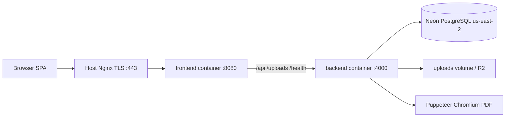
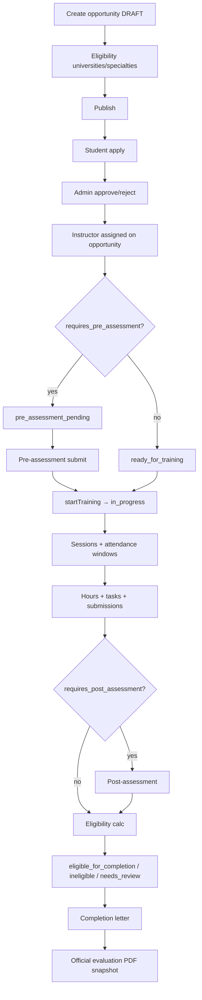
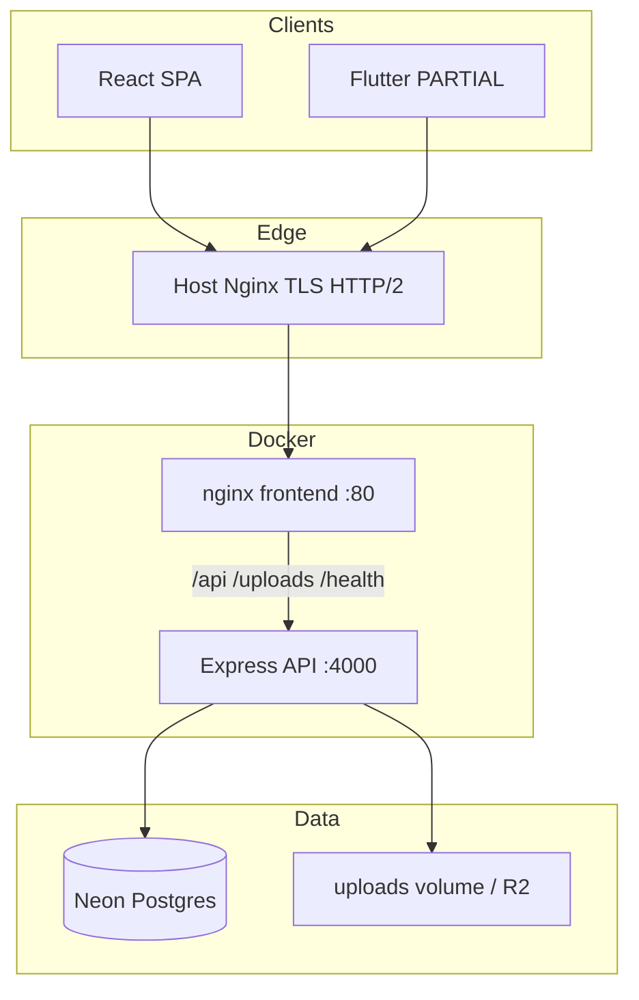
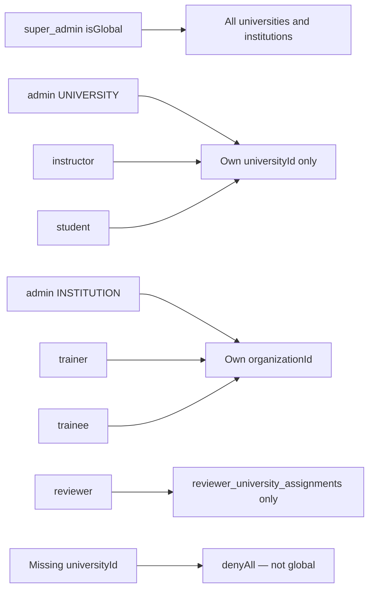
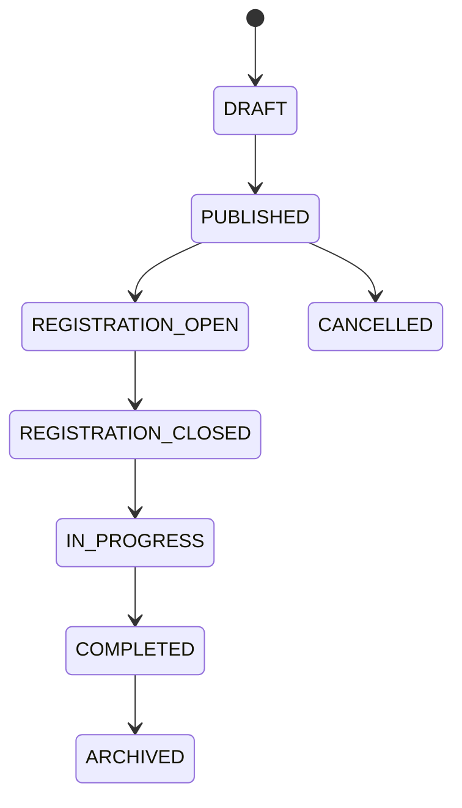
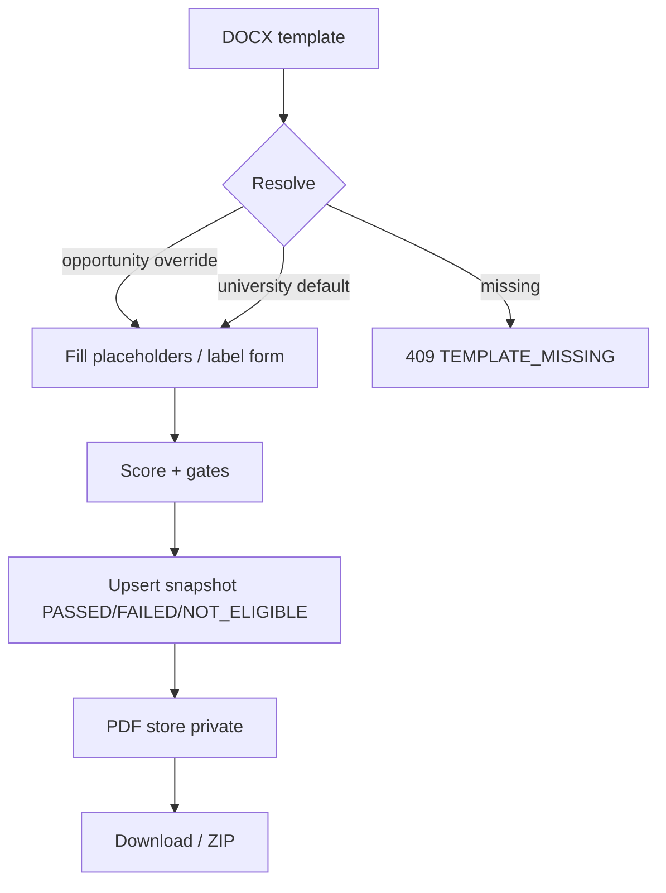

# BATTECHNO LMS — Master Project Documentation

Generated: 2026-08-27 (local inspection)

Repository state:

- Branch: `main`
- HEAD: `32d477e944d0bd8052eb9eff2b4606eba0575777`
- HEAD subject: `feat: automate field training evaluation templates and bulk reports`
- HEAD date: 2026-08-26 18:13:13 +0300

Documentation source: Current repository inspection (code, Prisma schema, Docker/Nginx, tests, git history). Older markdown in `/docs` and root `README.md` is treated as stale wherever it conflicts with code.

Production: https://lms.battechno.com

Purpose: Complete technical/product handoff for developers and AI assistants. A new conversation should be able to attach **only this file** and operate without prior chat history.

Status vocabulary used throughout:

| Label | Meaning |
| --- | --- |
| **IMPLEMENTED** | Present in current code and intended for use |
| **PARTIAL** | Present but incomplete, degraded, or diverges from comments/docs |
| **PLANNED** | Documented as future work; not implemented |
| **LEGACY** | Still in DB and/or code; not a current user-facing product |
| **DEPRECATED** | Canonicalized/aliased; do not assign or rebuild |
| **REMOVED** | Unmounted from UI/API; do not rebuild |
| **TECHNICAL_DEBT** | Known remaining issue |
| **NOT_CHECKED** | Could not be verified live in this inspection |

---

# NEW CHAT / AI HANDOFF QUICK CONTEXT

Read this section first. The rest of the document is the deep reference.

## What this project is

**BATTECHNO LMS** is a bilingual (Arabic-first, RTL) Learning Management System for **universities** and **training institutions** in Jordan / the BATTECHNO ecosystem. Production: `https://lms.battechno.com`.

It is **not** an accreditation/QA platform. User-facing product domains are only:

| Organization type | Product domains |
| --- | --- |
| **INSTITUTION** | Courses (training programs), Micro-Credentials |
| **UNIVERSITY** | Courses (training programs), Micro-Credentials, **Field Training** |

Shared infrastructure (not standalone products): Authentication, Users, Roles, Organizations, Files, Notifications, Reports, Certificates, Audit Logs, Settings, Help / Content Hub.

**Do not rebuild:** QA, Corrective Actions, Risk Cases, At-Risk Students (standalone), Integrity, Recognition, Standalone Evidence. Frontend pages and API routers are **REMOVED**. Database tables remain as **LEGACY_DATABASE_TABLE**. Super Admin analytics still queries some of those tables (**TECHNICAL_DEBT**).

## Current stack

- **Frontend:** React 18, Vite 5, React Router 6, TanStack Query, Axios, SCSS (app chrome) + Tailwind (landing only), i18next (`fallbackLng: ar`, RTL for `ar`)
- **Backend:** Node 20 (Docker `node:20-alpine`), Express 4, Prisma 6, PostgreSQL (Neon), JWT Bearer in `localStorage` (no cookies)
- **Infra:** Docker Compose two containers (`battechno-lms-backend` host `127.0.0.1:4400` → 4000; `battechno-lms-frontend` host `127.0.0.1:8080` → 80). Host Nginx TLS at `lms.battechno.com` → `:8080`. External Neon Postgres. Local/R2 file storage.
- **Mobile:** Flutter app under `mobile/battechno_lms_app` — **PARTIAL**, not the source of truth for product scope; some leftover QA/recognition screens exist there.

## Organizations and roles

Two org types: `UNIVERSITY` | `INSTITUTION`. There is **no Institution table**. Institutions are `organizations.type = INSTITUTION`. Universities have a `universities` row, optionally linked via `organization_id`.

Canonical roles (seven): `super_admin`, `admin`, `instructor`, `trainer`, `trainee`, `student`, `reviewer`.

- Same `admin` role is used for University Admin and Institution Admin. Difference is **portal** (`UNIVERSITY` / `INSTITUTION`) + assignment/org type — not a separate role code.
- `isGlobal` is **only** `super_admin`. Missing `universityId` / org assignment **never** means global access.
- Reviewer is **read-only** (view/export). Backend enforces this; frontend hiding is UX only.
- Legacy aliases (`program_admin`, `university_admin`, `academic_admin`, `qa_officer` → `admin`; `university_reviewer`/`academic_reviewer` → `reviewer`) must not be assigned.

University portal roles: `super_admin, admin, student, instructor, reviewer`.  
Institution portal roles: `super_admin, admin, trainer, trainee` (no reviewer on that portal).

## Dual course engines (TECHNICAL_DEBT)

1. **Primary Courses product:** `training_programs` + cohorts/sessions/tasks/assessments. UI: `/admin/training-courses`, `/trainer/courses`, `/trainee/courses`. Used by institutions **and** universities.
2. **Standalone LMS courses:** `courses` / `course_lessons`. UI: `/admin/courses` (Super Admin only, not in sidebar), `/student/courses`.
3. **Micro-Credentials:** `tracks` → `micro_credentials` → modules/contents + academic `cohorts`/`enrollments`. Instructor “My courses” is `/instructor/cohorts`. Student MC catalog is `/student/available-cohorts`. Trainee MC UX is **PARTIAL** (no trainee MC nav).

Do not merge engines without an explicit approved plan. Do not drop tables.

## Field Training (university-only)

Dedicated `field_training_*` tables — **not** `training_programs` of type `FIELD_TRAINING` (that enum value exists but live FT does not use it).

Lifecycle: Opportunity (draft → published → in_progress → archived) → eligibility → student application → admin approval → instructor assignment → optional pre-assessment → start training → sessions + attendance windows → hours → tasks/submissions → optional post-assessment → completion eligibility → completion letter.

**Evaluation Report ≠ Certificate ≠ Completion Letter.** Three different artifacts.

Official evaluation (HEAD `32d477e`, **IMPLEMENTED** in repo): university DOCX template → placeholder/label fill → PDF snapshot `PASSED | FAILED | NOT_ELIGIBLE`. Reviewer can download/ZIP existing PDFs, cannot generate. Institution roles are denied.

Last documented production deploy (2026-08-26 11:36 UTC) **predates** this commit. Whether production currently runs `32d477e` is **NOT_CHECKED** (no SSH this session). Live `GET /health` and `GET /health/ready` returned OK on 2026-08-27.

## Production architecture (current known)

- Domain: `https://lms.battechno.com` → `187.55.228.232` (`srv1829646.hstgr.cloud`, Hostinger Paris)
- Project path on server (from 2026-08-26 audit): `/root/BATTECHNO_LMS`
- Containers: `battechno-lms-backend`, `battechno-lms-frontend`
- Neon: AWS `us-east-2` (Ohio). Warm `SELECT 1` ~500 ms from Paris. **OPEN** bottleneck. EU migration is **PLANNED**, not executed.
- Auth N+1 / gzip / dashboard fan-out: **FIXED in repo** (and claimed deployed 2026-08-26). Remaining floor is DB RTT.

## Critical security rules

- Frontend route hiding is **not** security. Backend AuthZ is authoritative.
- JWT `roles` / `universityId` / `isGlobal` are informational; every request reloads DB context.
- Institution must not access Field Training.
- Reviewer must not silently receive write capabilities.
- Do not fabricate supervisor behavioral scores (missing ratings ≠ 5).
- Do not delete legacy QA/recognition/evidence tables during ordinary cleanup.
- Never run `prisma migrate reset` or `prisma db push --force-reset` on production.

## What not to do in a new chat

- Do not rebuild QA / Recognition / Evidence / Risk / Integrity / Corrective Actions.
- Do not treat `docs/ROLES_AND_PERMISSIONS.md` or root `README.md` as current (they still mention five roles and QA).
- Do not treat `docs/DEPLOYMENT.md` as live topology (stale Render/port 10000). Use `docker-compose.yml` + `deploy/nginx-lms.battechno.com.conf`.
- Do not collapse dual course engines without a plan.
- Do not include secrets in docs or commits.

## Current priority areas (from HEAD)

1. Field Training official evaluation templates, snapshots, PDF, reviewer ZIP (code complete in repo; production deploy of `32d477e` unverified).
2. Remaining DB latency (Neon region).
3. Dual course-engine consolidation (**not started**).
4. Trainee Micro-Credential UX (**PARTIAL**).
5. Legacy analytics queries against removed product tables.

---

# 1. Executive project summary

## What BATTECHNO LMS is

A multi-tenant LMS operated by BATTECHNO for:

- **Universities** delivering academic micro-credentials, training courses, and **field training** (practical training with host organizations).
- **Institutions** (training centers, government/private orgs) delivering training courses and micro-credentials.

Primary language is **Arabic**. Default locale is `ar` with `dir=rtl`. English is a second locale.

## Who uses it

| Actor | Portal | Typical use |
| --- | --- | --- |
| Super Admin | University or Institution (global) | All tenants, users, universities, institutions, FT, Content Hub, analytics |
| University Admin (`admin` + UNIVERSITY) | University | Students/instructors, training courses, MC, field training, reports |
| Institution Admin (`admin` + INSTITUTION) | Institution | Trainers/trainees, training courses, MC (no Field Training) |
| Reviewer | University | Read-only reports, FT evaluation PDFs, certificates, enrollment requests |
| Instructor | University | Academic MC cohorts + assigned Field Training |
| Student | University | Courses, MC cohorts, Field Training applications/progress |
| Trainer | Institution | Assigned training courses |
| Trainee | Institution | Enrolled training courses + certificates |

## Main product purpose

Operate learning and field-training workflows with scoped tenancy, attendance, assessments, completion rules, certificates, and official reports — without the former accreditation/QA case-management surface.

## Current product scope (verified against code)

**Institutions:** Courses (`/admin/training-courses`), Micro-Credentials. Field Training hidden and denied.

**Universities:** Courses (`/admin/training-courses`), Micro-Credentials, Field Training.

**Shared infrastructure:** Auth, users, roles, organizations, files, notifications (inbox + rules engine), reports, certificates, audit logs, settings, Help / Content Hub.

**Temporarily retained extra surfaces (not top-nav products):** Super Admin `/admin/courses` and `/admin/analytics`; university extra prefixes for tracks, learning outcomes, academic cohorts/sessions/assessments/rubrics/grades.

## High-level architecture



SPA is same-origin: empty `VITE_API_BASE_URL` in production so the browser calls `/api` on `lms.battechno.com`, proxied to the backend.

---

# 2. Technology stack

## Frontend (current)

| Piece | Actual |
| --- | --- |
| Framework | React 18.3 |
| Build | Vite 5.4 (`frontend/vite.config.js`) |
| Routing | `react-router-dom` 6.28 — `frontend/src/app/router/index.jsx` |
| Server state | TanStack Query 5 (`frontend/src/lib/queryClient.js`) |
| Forms | react-hook-form + Zod + `@hookform/resolvers` |
| HTTP | Axios (`frontend/src/services/apiClient.js`) — `Authorization: Bearer` |
| Styling | SCSS (`frontend/src/assets/styles/app.scss`) for app chrome; Tailwind 3 with `important: '#battechno-landing'` and `preflight: false` for landing only |
| Icons | lucide-react, react-icons |
| Charts | recharts |
| Client PDF/Excel | jspdf, xlsx (browser exports; official FT PDFs are server-side) |
| Localization | i18next + react-i18next; locales `frontend/src/i18n/locales/{ar,en}/`; `fallbackLng: 'ar'`; `DEFAULT_LOCALE = 'ar'` |
| RTL/LTR | `frontend/src/utils/locale.js` — `ar` → `dir=rtl`, `en` → `ltr` on `documentElement` and `body` |
| Component system | Mix of design-system components (`frontend/src/components/designSystem/`), CRUD helpers, feature pages. No MUI/Ant Design. |
| Motion | framer-motion (landing) |

Not used as app-wide: Redux, cookie sessions, WebSockets.

## Backend (current)

| Piece | Actual |
| --- | --- |
| Runtime | Node ≥18 in package.json; **Docker `node:20-alpine`**; CI Node 20 |
| Framework | Express 4 |
| Entry | `backend/src/server.js` → `backend/src/app.js` |
| Architecture | Feature modules: `routes → controller → service → repository` (some services query Prisma directly) |
| ORM | Prisma 6 (`@prisma/client`) |
| Validation | Zod |
| Auth | JWT (`jsonwebtoken`), bcrypt |
| Email | Resend |
| Files | Multer + local disk or Cloudflare R2 (`@aws-sdk/client-s3`) |
| PDF | Puppeteer + Chromium in Alpine image; ExcelJS; JSZip; mammoth (DOCX→HTML fallback); optional LibreOffice |
| AI | `@google/generative-ai` / OpenAI via `AI_PROVIDER` (empty = disabled) |
| Push | firebase-admin — **disabled unless Firebase env set** |
| Security headers | helmet, cors, express-rate-limit (many limiters exist; global `apiLimiter` is **not** mounted on `app.js`) |

Middleware (key): `auth.middleware.js`, `authorization.middleware.js`, `permission.middleware.js`, `error.middleware.js`, `validate.middleware.js`, request id/logger/perf timing.

## Database

| Piece | Actual |
| --- | --- |
| Engine | PostgreSQL |
| Hosting | Neon (production: AWS `us-east-2`) |
| Access | Prisma; runtime uses pooled `DATABASE_URL`; migrate uses `DIRECT_URL` or derived non-pooler host |
| Pooling | `PRISMA_CONNECTION_LIMIT` default 25; `PRISMA_POOL_TIMEOUT` 20s; `pgbouncer=true` when host contains `-pooler.` |
| Retry | `withDbRetry` for transient Neon disconnects |

## Infrastructure

| Piece | Actual |
| --- | --- |
| Docker | `docker-compose.yml` (labeled production stack). **No** `docker-compose.prod.yml`. |
| Frontend image | Vite build → `nginx:1.27-alpine` |
| Host reverse proxy | `deploy/nginx-lms.battechno.com.conf` — TLS, HTTP/2, proxy to `127.0.0.1:8080` |
| File/report storage | Compose volume `./storage/uploads:/app/uploads`; optional R2 |
| Domain | `lms.battechno.com`, `www.lms.battechno.com` |

## Testing

| Layer | Runner | Command |
| --- | --- | --- |
| Backend unit | Node built-in `node --test` with **explicit file list** (not a glob) | `cd backend && npm run test:unit` |
| Backend integration | same + DB guard | `cd backend && npm run test:integration` |
| Frontend unit | `node --test` 12 files | `cd frontend && npm run test:unit` |

No Jest/Vitest/Cypress in current `package.json`.

## Intentionally not listed as current stack

Render as the live API host, Docker port 10000, cookie sessions, Redis, Elasticsearch, GraphQL, MUI. Root `README.md` still mentions QA/recognition — **stale**.

---

# 3. Repository structure

```
/frontend          React SPA (battechno-lms-web)
/backend           Express API (battechno-lms-api) + Prisma
/docs              Older analysis/maintenance docs (many stale vs code)
/deploy            Host Nginx site config only
/mobile            Flutter client (partial / not product source of truth)
/.github/workflows CI
docker-compose.yml Production-style two-service compose
```

## `/frontend`

| Path | Purpose |
| --- | --- |
| `src/app/router/index.jsx` | **All SPA routes** |
| `src/app/router/lazyPages.js` | Lazy page imports |
| `src/app/providers/` | Query, locale, auth providers |
| `src/pages/` | Route pages by role (`admin`, `student`, `instructor`, `trainer`, `trainee`, `reviewer`, `academic`, `auth`) |
| `src/pages/admin/contentHub/` | Content Hub admin UIs |
| `src/pages/admin/fieldTraining/` | University FT admin |
| `src/features/` | API clients + hooks per domain (auth, training, fieldTraining, popups, …) |
| `src/components/` | Shared UI, navigation, Content CMS hosts |
| `src/layouts/` | `AdminLayout`, role layouts → `BaseDashboardLayout` |
| `src/constants/navigation.js` | Role sidebar (`NAV_BY_ROLE`) |
| `src/constants/adminNavigation.js` | Admin grouped nav + extra allowed prefixes |
| `src/constants/roles.js` | Canonical roles |
| `src/i18n/` | Locale JSON |
| `src/services/apiClient.js` | Axios + Bearer token |
| `src/lib/queryClient.js` | React Query client |
| `nginx.conf` | **Frontend container** Nginx |
| `tests/` | 12 unit tests |

Ownership: UI, routing, UX AuthZ (not authoritative).

## `/backend`

| Path | Purpose |
| --- | --- |
| `src/app.js` | Express app, health, CORS, mounts |
| `src/server.js` | Process listen |
| `src/routes/index.js` | `/api/v1` module mounts |
| `src/modules/<domain>/` | Feature packages |
| `src/middlewares/` | Auth, AuthZ, errors, validation |
| `src/config/env.js` | Typed env + role allowlists |
| `src/config/db.js` | Prisma client + pool URL |
| `src/utils/` | `roleCanon.js`, `universityScope.js`, `organizationScope.js`, jwt, logger |
| `src/shared/storage/` | local / R2 providers |
| `src/shared/services/` | audit, email, notifications, event dispatcher |
| `prisma/schema.prisma` | **Data model source of truth** |
| `prisma/migrations/` | Forward-only SQL |
| `scripts/start-production.js` | `prisma migrate deploy` then server |
| `tests/` | Unit/integration (~97 files; not all in `test:unit` list) |

## `/prisma`

Lives at `backend/prisma/` (not repo root). Schema + migrations + seed + baselines.

## `/deploy`

Only `nginx-lms.battechno.com.conf`.

## `/docs`

Historical. Prefer this master file + current code. Notable stale: `docs/DEPLOYMENT.md`, `docs/ROLES_AND_PERMISSIONS.md`, `docs/project-analysis/*` model counts, root `README.md`.

## `/mobile/battechno_lms_app`

Flutter client talking to the same API. Contains leftover reviewer QA/recognition screens. **Do not treat as product-scope source of truth.**

---

# 4. Product domain model

## 4.1 Courses

### Engines (current)

| Engine | Tables | Who uses it | Primary? |
| --- | --- | --- | --- |
| **Training courses** | `training_programs` + `training_cohorts` + sessions/tasks/assessments | Institution admin/trainer/trainee; University admin (sidebar “Training courses”) | **Yes — current Courses product** |
| **Standalone LMS courses** | `courses`, `course_sections`, `course_lessons`, `course_enrollments` | Super Admin `/admin/courses`; university students `/student/courses` | Secondary / **KEEP_TEMPORARILY** |
| **MC curriculum** | `tracks` → `micro_credentials` → `modules`/`contents` + academic `cohorts` | University MC delivery; instructor “My courses” | Micro-Credentials domain |

`training_program_type` enum includes `FIELD_TRAINING` and `TRAINING_COURSE`. Live Field Training uses **dedicated** `field_training_*` tables. Default program type is `TRAINING_COURSE`.

### Institution usage

Institution Admin creates/publishes training programs, cohorts, trainer assignments, enrollments, materials, recorded lectures, pre/post tests, tasks, attendance, completion/finalization, official training reports, training certificates.

Trainer operates assigned programs (capability flags on `training_trainer_assignments`).

Trainee consumes `/trainee/courses` (lazy `?sections=`).

### University usage

University Admin sidebar “Training courses” is the **same** training-program engine (`/admin/training-courses`), not `/admin/courses`.

University students also have `/student/courses` (standalone engine) and `/student/training-programs` (“My training courses”).

### Dual-engine technical debt

Both engines remain because a destructive merge was explicitly avoided. Consolidation is **PLANNED / TECHNICAL_DEBT**, not implemented. Do not drop `courses` or `training_programs`.

## 4.2 Micro-Credentials

Hierarchy: **Track** (required parent, hidden from top nav; extra path `/admin/tracks`) → **Micro-credential definition** → **learning outcomes** (nested on MC view; standalone `/admin/learning-outcomes` extra prefix) → academic **cohort** → **enrollment** → **sessions / attendance / assessments / rubrics / submissions / grades** → **certificate** (`certificates` table).

Supporting modules (nested infrastructure, not standalone products): tracks, learning outcomes, academic cohorts, sessions, attendance, assessments, rubrics, submissions, grades.

University vs Institution: both see Micro-Credentials in admin nav. Field Training is university-only; MC is shared.

Trainee MC UX: **PARTIAL** — trainee nav has no MC item; university students use `/student/available-cohorts`.

## 4.3 Field Training

University-only (+ Super Admin). Complete workflow is §16. Official evaluation is §17–25. Independent of training-program type `FIELD_TRAINING`.

---

# 5. Organization model

## Types

```prisma
enum organization_type { UNIVERSITY INSTITUTION }
```

- **UNIVERSITY:** partner university. Row in `universities` (name, status, partnership_state, optional unique `organization_id`). Students/instructors/reviewers scoped by `universityId`.
- **INSTITUTION:** training org. `organizations.type = INSTITUTION` plus optional `institution_kind`, branches, departments. No separate Institution model.

## Tenant / scope

| Scope | How resolved |
| --- | --- |
| University | `req.user.universityId` from DB context (reviewer: **only** `reviewer_university_assignments`; no `primary_university_id` fallback). Super Admin `isGlobal` may omit filter. |
| Institution | `req.user.organizationId` + `user_organization_assignments` (`role_code` string, `is_active`) |
| Portal | JWT `portalType` required: `UNIVERSITY` \| `INSTITUTION`. Login body must send it. |

`applyPortalScope`: Institution portal **clears** `universityId`. University portal with an INSTITUTION assignment clears that assignment and sets `organizationType = 'UNIVERSITY'`.

**Invariant:** missing `universityId` is deny-all (`universityScope.denyAllWhere()`), never global. Only `isGlobal` (`super_admin`) bypasses tenant scope.

## How users belong

1. `user_roles` → `roles.code` (canonical).
2. `user_organization_assignments` — org membership + `role_code` (string, not FK).
3. `users.primary_university_id` / `university_specialty_id` / `university_student_number` — university student identity.
4. `reviewer_university_assignments` — reviewer university scope (`EMAIL_DOMAIN` | `MANUAL` | `MIGRATION`).

University-specific: specialties, university specialties, email domains, FT opportunities.

Institution-specific: branches, departments, `allows_public_trainee_registration`, training programs owned by `organization_id`.

---

# 6. Role model

Canonical source: `backend/src/utils/roleCanon.js` and `frontend/src/constants/roles.js`.

| Role | Org context | Navigation | Allowed domains | Important permissions | Scope | Denied |
| --- | --- | --- | --- | --- | --- | --- |
| `super_admin` | Global (`isGlobal`) | Full admin + universities/institutions + Content Hub | All | Full catalog | Optional university filter | — |
| `admin` + UNIVERSITY | University | Dashboard, training courses, MC, FT, students, instructors, reports, certificates, notifications, Content Hub | Courses, MC, FT, users (student/instructor), reports | Admin write within university | Forced `universityId` | Other universities; institution portal FT |
| `admin` + INSTITUTION | Institution | Dashboard, training courses, MC, trainees, trainers, reports, certificates, notifications, Content Hub | Courses, MC | Org-scoped training | Forced org | **Field Training** |
| `reviewer` | University assignment | Reviewer dashboard, reports, certificates, FT reports, enrollment requests | FT reports/certs (read), enrollment requests | `view`/`export` only; `REVIEWER_READ_ONLY` on non-GET | Reviewer assignment only | Generate eval PDFs; templates/policy write; institution FT |
| `instructor` | University | Dashboard, cohorts (MC), FT (assigned), attendance, submissions, assessments, grades | MC delivery + assigned FT | Delivery/academic write on assigned | University + assignment | Approve FT applications; university-wide eval default template |
| `student` | University | Home, courses, training courses, MC, FT, grades, certificate | Courses, MC, own FT | Self-scoped | University | Other students’ data; FT admin |
| `trainer` | Institution | Dashboard, training courses | Training courses | Capability flags on assignment | Org + assignment | Field Training; university admin |
| `trainee` | Institution | Dashboard, training courses, certificates | Training courses | Self-scoped | Org | Field Training; MC nav **PARTIAL** |

Frontend assignable:

- University: student, instructor, admin, reviewer
- Institution: trainee, trainer, admin, reviewer (`INSTITUTION_ASSIGNABLE_ROLE_CODES` includes reviewer; **institution portal `evaluatePortalAccess` does not include reviewer** — treat institution reviewer as **PARTIAL** / unused in practice)

`super_admin` is not assignable via normal user-management (`ROLE_META.super_admin.assignable: false`).

## Role matrix (product domains)

| Role | University | Institution | Courses (training) | Standalone courses | MC | FT | Reports | Templates (FT eval) | Content Hub |
| --- | --- | --- | --- | --- | --- | --- | --- | --- | --- |
| super_admin | Yes | Yes | Yes | Yes (hidden nav) | Yes | Yes | Yes | Any university | Yes |
| admin (UNI) | Yes | — | Yes | No (Unauthorized) | Yes | Yes | Yes | Own university | Yes |
| admin (INST) | — | Yes | Yes | No | Yes | **No** | Yes (non-FT) | **No** | Yes |
| reviewer | Yes | Hidden FT | — | — | enrollment requests | Reports/ZIP read | Yes | No write | No |
| instructor | Yes | — | — | — | Yes (cohorts) | Assigned | Assigned | Opp override only | No |
| student | Yes | remapped to trainee nav if institution | Both catalogs | Yes | Yes | Yes | Own | Own finalized PDF | Consumer help |
| trainer | — | Yes | Yes | — | No nav | No | Assigned | No | No |
| trainee | — | Yes | Yes | — | **PARTIAL** | No | — | No | Consumer help |

---

# 7. Authentication and authorization

## Login flow (**IMPLEMENTED**)

`POST /api/auth/login` — `email`, `password`, **`portalType`: `UNIVERSITY` | `INSTITUTION`** required.

1. User lookup + bcrypt (10 rounds).
2. Gates: email verified; `status === 'active'` (else EMAIL_NOT_VERIFIED / ACCOUNT_PENDING_ACTIVATION / REJECTED / DISABLED).
3. Load roles + permissions; compute `isGlobal` from `super_admin` only.
4. Active org assignments; `evaluatePortalAccess` / `throwIfPortalMismatch`.
5. Sign JWT; return `{ token, user }`; `touchLastLogin`.

Register: `POST /api/auth/register` (university student) and `POST /api/auth/institutions/register` (trainee). Both start `inactive` + email OTP.

Password reset and email OTP: dedicated routes under `/api/auth`.

## Token / session

- JWT payload: `userId`, `roles`, `universityId`, `isGlobal`, `portalType`. Expiry `JWT_EXPIRES_IN` default **7d**.
- **No cookies / no refresh tokens** in backend src.
- Frontend `localStorage` key `battechno_lms_auth_token` (`frontend/src/utils/storage.js`).
- Logout: server message only; client drops token.

## Auth middleware (authoritative)

`backend/src/middlewares/auth.middleware.js`: Bearer JWT → require `portalType` → `loadCurrentAuthContext(userId)` from **DB** → `enforceAcademicReviewerReadOnly`.

JWT roles/`isGlobal`/`universityId` are **not** used for AuthZ after verify.

Key files:

| File | Role |
| --- | --- |
| `backend/src/modules/auth/auth.routes.js` | Auth HTTP |
| `backend/src/modules/auth/auth.service.js` | Login, `/me`, `isGlobal` |
| `backend/src/modules/auth/currentAuthContext.js` | Batched DB identity |
| `backend/src/modules/auth/portalAccess.js` | Portal eligibility |
| `backend/src/modules/auth/rolePermissionCache.js` | 60s permission cache |
| `backend/src/utils/universityScope.js` | University filter / deny-all |
| `backend/src/utils/organizationScope.js` | Org filter |
| `backend/src/middlewares/permission.middleware.js` | `requirePermission` + reviewer read-only |
| `frontend/src/components/common/ProtectedRoute.jsx` | Must be logged in |
| `frontend/src/components/common/RoleBasedRoute.jsx` | Role shell |
| `frontend/src/utils/rolePermissions.js` | **UX** permission matrix |

**Frontend authorization is UX. Backend authorization is authoritative.** Direct URLs: admin unknown paths → 404; instructor/student/reviewer unknown paths inside permission outlet → **UnauthorizedPage** (not always 404).

## `/auth/me` performance (**FIXED** in repo)

Authenticate already loads context. `me()` reuses `req.authContext` (`_profile`, assignments, roles, permissions, university). Test: `backend/tests/auth.me.contextReuse.unit.test.js`.

Auth load: two `Promise.all` waves + 60s caches (`rolePermissionCache`, university/org `lookupCache`). Remaining latency is Neon RTT (~500 ms/wave) — see §33–34.

---

# 8. Frontend routing

Source: `frontend/src/app/router/index.jsx`.

## Public

`/`, `/portals`, `/verify/certificate/:verificationCode`, `/privacy-policy`, `/account-deletion`, `/verify/report/:verificationCode`

## Auth

`/login` (redirect), `/login/admin`, `/login/instructor`, `/login/student`, `/login/reviewer`, `/institutions/login`, `/institutions/register`, `/universities/login`, `/register`, `/verify-email`, `/forgot-password`, `/reset-password/verify`, `/reset-password/new`, `/account-status`, `/select-organization`

## Super Admin + University Admin + Institution Admin (`/admin`)

Shared tree `allowedRoles={super_admin, admin}`. Index → `/admin/dashboard`.

Includes: dashboard, training-courses (+ create/edit/lectures), micro-credentials, users, universities, institutions, tracks, learning-outcomes, cohorts, enrollments, content, sessions, attendance, assessments, rubrics, submissions, grades, certificates, notifications, notification-settings, reports, audit-logs, settings, roles-permissions, **full Content Hub**, field-training (+ applications/manage/tasks/reports/evaluation-templates).

Gates:

- Field Training: `SuperAdminFieldTrainingRoute` — Institution `admin` **Unauthorized** unless global.
- `/admin/analytics`, `/admin/courses`: Super Admin only.

Redirects: `/admin/help` → Content Hub help; `/admin/field-training-reports` → `/admin/field-training/reports`.

## Extra `/academic` (admin + reviewer)

Not in sidebar. Field training report aliases: reports, evaluations, university, students, opportunities, student report.

## Reviewer `/reviewer`

dashboard, enrollment-requests, university-reports, field-training/reports (+ evaluations/university/students), certificates, user-guide, notifications. `/reviewer/field-training` redirects to reports.

## Instructor `/instructor`

dashboard, cohorts, sessions, enrollments, attendance, assessments, submissions, grades, field-training (+ manage/participants/sessions/attendance/tasks/submissions/results/eligibility), user-guide, notifications. **`/instructor/at-risk-students` → NotFoundPage (explicit).**

## Student `/student`

dashboard, courses, training-programs (redirect/institution page), field-training, available-cohorts, programs, content, sessions, attendance, assessments, submissions, grades, certificate, semester-schedule, user-guide, notifications. `/student/enrollments` → `/student/programs`.

## Trainer `/trainer`

dashboard, courses (+ edit/tabs/lectures), notifications, user-guide, profile.

## Trainee `/trainee`

dashboard, courses, certificates, notifications, user-guide, profile.

## 404 behavior

`NotFoundPage` (`emptyStates.notFound`, subtitle 404). Admin splat → `AdminNotFoundPage` → same. Trainer/trainee splat → NotFound. Global splat → NotFound. Instructor/student/reviewer splat inside `RoleShellPermissionOutlet` → **UnauthorizedPage** if `UI_ROUTE_DENY`.

## REMOVED / LEGACY ROUTES (now 404 or Unauthorized)

| Path | Behavior |
| --- | --- |
| `/admin/qa`, `/admin/qa-reviews/*` | 404 |
| `/admin/corrective-actions/*` | 404 |
| `/admin/at-risk-students`, `/admin/risk-cases/*` | 404 |
| `/admin/integrity-cases/*` | 404 |
| `/admin/recognition-requests/*` | 404 |
| `/admin/evidence/*` | 404 |
| `/instructor/at-risk-students` | explicit 404 |
| `/instructor/evidence`, `/instructor/risk-students` | Unauthorized (splat) |
| `/reviewer/recognition-requests`, `/reviewer/evidence` | Unauthorized (splat) |

i18n JSON for those modules may still load; pages do not exist.

---

# 9. Navigation

Builders: `frontend/src/constants/navigation.js`, `adminNavigation.js`. Labels: `frontend/src/i18n/locales/{en,ar}/navigation.json`.

Institution learners with `role === student` are remapped to **trainee** nav.

## Super Admin

Main: Dashboard. Organizations: Universities, Institutions. Training: Training courses, Micro-credentials, Field training. Platform: Users, Reports, Digital certificates, Notifications, Audit log, Settings, Roles and permissions. **Content & help management** (restored). Extra (not sidebar): `/admin/courses`, `/admin/analytics`.

Arabic examples: لوحة التحكم، الجامعات، المؤسسات، الدورات التدريبية، الشهادات المصغرة، التدريب الميداني، المستخدمون، التقارير، سجل التدقيق.

## University Admin

Dashboard; Training courses; Micro-credentials; Field training; Students (`/admin/users?role=student`); Instructors (`?role=instructor`); Reports; Digital certificates; Notifications; Content Hub.

## Institution Admin

Same Main **except** Field Training / Students / Instructors hidden; Trainees (`?role=trainee` المتدربون); Trainers (`?role=trainer` المدربون); Content Hub.

## Reviewer

University reviewer dashboard (لوحة مراجع الجامعة); Reports; Certificates; Field training reports (UNIVERSITY portal); Enrollment requests; User guide; Notifications.

## Instructor

Dashboard; My courses (`/instructor/cohorts` دوراتي); Field training (UNIVERSITY); Attendance; Submissions; Assessments; Grades; Notifications; User guide.

## Trainer

Dashboard; Training courses; Notifications; Trainer guide (دليل المدرب); Profile.

## Student (university)

Home (الرئيسية); My courses; My training courses; Micro-credentials; Field training; Grades; Digital certificate; Notifications; User guide.

## Trainee

Dashboard; My training courses; Certificates; Notifications; Trainee guide; Profile.

## Content Hub (restored)

Collapsible group `contentHelp` for `super_admin` and `admin` only. Arabic/English labels in §10.

---

# 10. Content Hub

Admin routes under `/admin/content-hub/*`. Access: Super Admin + org Admin. Not reviewer/instructor/student/trainer/trainee (they have consumer `/user-guide`).

| Feature | Status | Path |
| --- | --- | --- |
| Help (user guide articles) | **IMPLEMENTED** | `/admin/content-hub/help` (+ create/edit) |
| Product Tours (user-guides + steps) | **IMPLEMENTED** | `/admin/content-hub/tours` |
| Popups | **IMPLEMENTED** | `/admin/content-hub/popups` |
| Announcements | **IMPLEMENTED** | `/admin/content-hub/announcements` |
| Notifications management / rules | **IMPLEMENTED** | `/admin/content-hub/notifications` |
| Manual notification send | **IMPLEMENTED** | `.../notifications/send` |
| Delivery history | **IMPLEMENTED** | `.../notifications/deliveries` |
| Notification analytics | **IMPLEMENTED** | `.../notifications/analytics` |
| Contextual help (editor of flags on existing articles) | **IMPLEMENTED** | `/admin/content-hub/contextual` |
| Content analytics | **PARTIAL** | `/admin/content-hub/analytics` — help stats + some announcement stats; **no popup analytics** |
| Content audit | **PARTIAL** | `/admin/content-hub/audit` — client-filters generic `audit_logs`; not a dedicated API |

Consumer: `ContentCmsHosts` + `FieldTrainingTourHost` on every dashboard layout. Contextual help button on selected student/instructor/reviewer pages.

Inbox `/admin/notifications` is **not** Content Hub (user inbox).

---

# 11. Popups

**IMPLEMENTED.** Models: `managed_popups`, `managed_popup_user_states`.

Supported concepts (schema + admin UI):

| Concept | Fields |
| --- | --- |
| Type | `INFO | SUCCESS | WARNING | IMPORTANT | URGENT` |
| Frequency / display rule | `ONCE | ONCE_PER_VERSION | EVERY_LOGIN | UNTIL_ACKNOWLEDGED | DATE_RANGE | EVENT_TRIGGERED` |
| Active state | `DRAFT | PUBLISHED | PAUSED | ARCHIVED` |
| CTA | `cta_label`, `cta_url` |
| Scheduling | `starts_at`, `ends_at`, `priority` |
| Audience | `target_roles[]`, `target_university_ids[]`, `target_specialty_ids[]`, `target_user_ids[]`, `target_opportunity_id`, `target_session_id`, `target_pages[]` |
| Trigger | `trigger_event`, `system_key` |
| Ack / dismiss | `is_dismissible`, `requires_acknowledgement`, `max_impressions` |
| Version | `version`; user state tracks `popup_version`, view/dismiss/ack/click |

Frontend: `ManagedPopupsHost` fetches `GET /api/v1/popups/active`, filters `target_pages` vs `location.pathname`. Shared modal with announcement POPUPs (`pickHighestPriorityModal` — they never stack).

Admin API: `/api/v1/admin/popups` (CRUD, publish, pause, archive).

Query: active list on dashboard layout mount; user state updated on view/dismiss/ack. Not a 60s poll (unlike notification unread count).

---

# 12. Announcements

**IMPLEMENTED.** Models: `announcements`, `announcement_targets`, `announcement_channels`, `announcement_user_states`.

- Create/edit via Content Hub wizard: content, audience, channels, schedule, acknowledgement, preview.
- Status: `DRAFT | SCHEDULED | PUBLISHED | PAUSED | EXPIRED | ARCHIVED`.
- Timezone default `Asia/Amman`.
- Channels enum includes `TOP_BANNER`, `DASHBOARD_CARD`, `POPUP`, `NOTIFICATION_CENTER`, `IN_APP_NOTIFICATION`, `CONTEXTUAL_BLOCK`, `EMAIL`, `PUSH_NOTIFICATION`, `SMS`. Frontend host implements **TOP_BANNER, DASHBOARD_CARD, POPUP** (dashboard cards only on dashboard paths). Email/push/SMS channel codes exist; do not assume they all deliver.
- Targets: `ALL_USERS`, `ROLE`, `UNIVERSITY`, org, specialty, opportunity, session, user, plus status filters.
- Permissions: admin CMS write; consumers `GET /api/v1/announcements/active` + view/dismiss/ack/click.

---

# 13. Notifications

Two layers:

### A. In-app consumption (**IMPLEMENTED**)

- Model `notifications` with `deduplication_key`, `notification_type`.
- Bell: `NotificationBell` — unread count poll **60s** (`useUnreadNotificationCount`).
- Inbox pages at `/{role}/notifications`; preferences at `notification-settings`.
- Deep links via `notificationDeepLink.js`.

### B. Admin notification management (**IMPLEMENTED**)

Content Hub: rules, templates, manual send, delivery history, analytics. APIs:

- `/api/v1/admin/notification-rules`
- `/api/v1/admin/notification-templates`
- `/api/v1/admin/notifications` (ops/send)

Engine tables: `notification_rules`, `notification_templates`, `notification_deliveries`, `notification_preferences`, `notification_digests`, `notification_scheduled_jobs`.

Event dispatcher (`eventDispatcher.service.js`) still has handlers for **removed** recognition/integrity events (**LEGACY / TECHNICAL_DEBT** if no emitters remain).

Mobile push: `mobile_push_registrations` — **PARTIAL** (off without Firebase env).

---

# 14. Courses — complete workflow (training-program engine)

Primary UI: `/admin/training-courses`, `/trainer/courses`, `/trainee/courses`. API prefix: `/api/v1/training`.

## Lifecycle (program)

Statuses: `DRAFT → PUBLISHED | REGISTRATION_OPEN | REGISTRATION_CLOSED | IN_PROGRESS | COMPLETED | CANCELLED | ARCHIVED`.

Publish emits `COURSE_PUBLISHED` / audit `TRAINING_PROGRAM_PUBLISHED`.

## Cohort

Statuses: `DRAFT | OPEN | IN_PROGRESS | COMPLETED | CANCELLED | ARCHIVED`. Optional branch/department, capacity.

## Trainer assignment

`training_trainer_assignments` with capability flags (`can_manage_sessions`, attendance, materials, tasks, grade, assessments, view trainees/progress/reports, `can_finalize_training`, announcements). Instructors on `training_cohort_instructors` are a separate join (not university FT instructors).

## Trainee enrollment

Statuses: `INVITED | PENDING | APPROVED | REJECTED | NEEDS_UPDATE | ACTIVE | WITHDRAWN | REQUIREMENTS_COMPLETED | COMPLETED | NOT_COMPLETED`.

## Sessions / attendance

`training_sessions` (`SCHEDULED | LIVE | COMPLETED | CANCELLED | RESCHEDULED`) + attendance windows (hashed codes) + `training_attendance_records` (`attendance_status`).

## Materials / recorded lectures

`training_materials` (LINK or file via `files`). Course content service supports recorded lectures (YouTube playlist optional via `YOUTUBE_API_KEY`).

## Tasks / submissions

`training_tasks` / `training_task_submissions` — MANUAL grading default, required/final flags, attempts.

## Pre / post assessment

`training_assessments` unique `(program_id, kind)` where kind is `PRE_TEST | POST_TEST`. Attempts: `NOT_AVAILABLE | AVAILABLE | IN_PROGRESS | SUBMITTED | GRADED | EXPIRED`.

## Final evaluation (course survey — not FT 10-criteria)

`training_evaluation_templates` (NPS, ratings, sections TRAINER/CONTENT/ACTIVITIES/VENUE_ORG/IMPACT/NPS_FEEDBACK). Assignment statuses `LOCKED → AVAILABLE → … → SUBMITTED`. **Different product** from Field Training official evaluation.

## Progress / completion / certificate / reports

`training_progress` + `training_requirements`. Completion service: eligibility `READY_TO_COMPLETE` vs missing requirements; finalization modes `ELIGIBLE_ONLY | EXCEPTIONAL`. Certificates: `NOT_ELIGIBLE | ELIGIBLE | PENDING_ISSUANCE | ISSUED | REVOKED`. Official reports persisted in `training_official_reports` (PDF/Excel under uploads).

### Admin vs trainer vs trainee

- Admin: full org-scoped CRUD, publish, finalize, reports.
- Trainer: assigned programs only; finalize only if `can_finalize_training`.
- Trainee: consume published content, submit tasks/tests/evaluation, view own certificate.

Standalone `courses` engine: Super Admin catalog + student lesson progress/workflow — **IMPLEMENTED** but not the institution product path.

---

# 15. Micro-Credentials — complete workflow

**IMPLEMENTED** for university academic delivery; **PARTIAL** for trainee-facing UX.

1. Track (`tracks`) — required parent; extra admin path, not top-level product.
2. Micro-credential definition (`micro_credentials`) — code, delivery_mode, internal_approval_status, university links (`micro_credential_universities`), versions.
3. Learning outcomes — nested on MC view.
4. Modules / contents — sequenced curriculum.
5. Cohort — `cohorts` with `micro_credential_id`, `university_id`, optional `instructor_id`.
6. Enrollment — unique `(cohort_id, student_id)`; pending → enrolled/rejected (`ENROLLMENT_DECISION_ROLE_CODES`).
7. Sessions / attendance / assessments / rubrics / submissions / grades — academic tables (UUID FKs often without Prisma `@relation`).
8. Certificate — `certificates` (`certificate_no`, `verification_code`, `issued | revoked | superseded`).

University vs Institution: both have admin MC nav. Instructor delivery is university-oriented (`/instructor/cohorts`). Student catalog `/student/available-cohorts`. Trainee: **no equivalent nav** — incomplete trainee MC UX.

Rubrics standalone page: **KEEP_TEMPORARILY** (extra prefix `/admin/rubrics`).

Temporary: dual relationship with training-course engine (separate enrollment tables).

---

# 16. Field Training — complete workflow

University-only. Module: `backend/src/modules/fieldTraining/` (~60 files).



## Statuses

**Opportunity:** `draft | published | in_progress | archived`

**Application:** `pending | approved | rejected | cancelled`

**Training:** `none | pre_assessment_pending | pre_assessment_completed | ready_for_training | in_training | task_pending | task_submitted | post_assessment_pending | post_assessment_completed | eligible_for_completion | completed | failed | expelled`

**Completion eligibility (workflow):** `pending | eligible | ineligible | needs_review`

**Attendance:** present/late/excused count as attended; absent/unconfirmed do not. Denominator = required sessions.

**Hours:** stored `completed_training_hours` (REPLACE) and/or derived from attendance × duration. Progress: `not_started | in_progress | completed`.

## Guards (`fieldTraining.workflow.js`)

- Instructor **cannot** approve/reject applications.
- `canAccessTrainingContent`: approved, not expelled, in `ACTIVE_TRAINING_STATUSES`.
- Pre/post assessment gated by opportunity flags + status.
- Institution portal / trainer / trainee: `PORTAL_MISMATCH` / `FIELD_TRAINING_FORBIDDEN`.

## Two eligibility systems (**TECHNICAL_DEBT**)

1. Workflow `calculateFieldTrainingEligibility` (attendance, hours, post-assessment, final task, expelled/failed, optional `manual_review_required` → `needs_review`).
2. Official evaluation **gates** (`GATE_REASONS`) → `NOT_ELIGIBLE` vs `PASSED`/`FAILED`.

They can disagree. Do not assume they are the same.

## Completion letter vs evaluation PDF vs LMS certificate

Issuing a completion letter sets `training_status: completed` and writes `field_training_completion_letters` (HTML→PDF Chromium). It does **not** generate the official evaluation PDF. Evaluation does **not** issue a letter or `certificates` row.

---

# 17. Field Training final evaluation system

**IMPLEMENTED** in repository (commit `32d477e`, migration `20260826160000_field_training_evaluation_reports`). Production running this commit: **NOT_CHECKED**.

## Template system

Model `field_training_evaluation_templates`: university-owned, versioned, `validation_status` `pending | valid | invalid`, `is_default`, `is_active`, `archived_at`, `original_file_id` → private `files`.

Resolution (`resolveTemplate`):

1. Opportunity `evaluation_template_id` if not archived → source `opportunity`
2. University default (`is_default`, `is_active`, not archived)
3. Else `FIELD_TRAINING_EVALUATION_TEMPLATE_MISSING` (409) — **never fake a report**

Usable if not archived AND (`valid` OR `validation_json.fillMode === 'label_form'`).

Upload: DOCX only, max 50MB, `filesService.storePrivateBuffer` folder `training`. Replace archives previous row and increments version. Setting default archives previous default. Instructor upload **forces `is_default=false`**. Opportunity upload auto-assigns override.

Label-form bypass: Arabic university forms without `{{placeholders}}` still fill via `fieldTrainingEvaluation.formFill.js`.

**TECHNICAL_DEBT:** `findUsableTemplate` can pick another university’s template and rewrite `university_id`. `activate` on upload body unused. Schema comment “historical rows never overwritten” vs in-place upsert — see §21.

## Roles

| Actor | Upload / replace | Assign / default / policy | Generate / regenerate | Download / ZIP |
| --- | --- | --- | --- | --- |
| Super Admin | Any university | Yes | Yes | Yes |
| University Admin | Own university | Yes | Yes (admin/instructor write routers) | Yes |
| Instructor | Assigned opportunity only | Override only; not university default/policy | Assigned opps | Assigned |
| Reviewer | No | No | **403 `REPORT_READ_ONLY`** | Own university, existing files; ZIP yes |
| Student | No | No | No | Own finalized PDF only |
| Institution admin / trainer / trainee | Deny | Deny | Deny | Deny |

Write routes: admin + instructor only. Academic/reviewer: read + ZIP only.

## Placeholders (actual `PLACEHOLDERS` + generated keys)

Named: `student_name`, `student_number`, `student_specialty`, `semester`, `academic_year`, `training_start_date`, `training_end_date`, `training_days`, `actual_training_hours`, `actual_daily_hours`, `absence_days`, `attendance_percentage`, `organization_name`, `organization_department`, `organization_email`, `organization_phone`, `organization_fax`, `organization_address`, `completion_status`, `final_status`, `final_score`, `final_percentage`, `professional_evaluation_total`, `professional_evaluation_percentage`, `general_comments`, `field_supervisor_name`, `responsible_person_name`, `evaluation_date`, `eligibility_reasons`.

Also: `criterion_1_score`…`criterion_10_score`; grid `c1_1`…`c10_5` (checkmark `✓` in scored cell).

Unknown `{{name}}` → blank. Null → blank.

**Not in code (do not invent):** `university_name`, `opportunity_title`, `pre_assessment_score`, `post_assessment_score`, `improvement_percentage`, signature/stamp tokens. Stamps remain as images inside the uploaded DOCX zip.

Required validation groups (unless label-form): student_name, student_number, training dates, grid `c1_1`+`c10_5`, professional total, general_comments.

---

# 18. Field Training student data mapping

Builder: `buildFieldTrainingEvaluationTemplatePayload` in `fieldTrainingEvaluation.payload.js`.

| Report field | Source | Required identity? |
| --- | --- | --- |
| Student Name | `users.full_name` | Yes |
| University Number | `users.university_student_number` (never user UUID; empty → `NA` in filename, missing fails identity) | Yes |
| Specialty | `university_specialties` / `specialties` via `findStudentProfilesByIds` | Yes |
| Semester | Derived from opportunity `start_date` (Jordan calendar: Jun–Aug صيفي, Sep–Jan الفصل الأول, Feb–May الفصل الثاني) | No (derived) |
| Academic Year | Same (`2025/2026`) | No (derived) |
| Training Start/End | `field_training_opportunities.start_date` / `end_date` (`DD/MM/YYYY` UTC) | Yes |
| Training Days | Count attendance present/late/excused | No |
| Actual Hours | `applications.completed_training_hours` if >0 else derived | No |
| Daily Hours | actualHours / attendedDays (1 decimal) | No |
| Absence Days | attendance `absent` only (unconfirmed not counted) | No |
| Attendance % | `applications.attendance_percentage` | No |
| Organization Name | `opportunities.organization_name` | No |
| Department | `host_organization.department` | No |
| Email/Phone/Fax | `host_organization.*` | No |
| Address | `host_organization.address` else `opportunities.location` | No |
| Field supervisor / responsible person | **Both** `assigned_instructor_id` user’s `full_name` | No |
| Evaluation date | Generate time | No |

Missing required identity → HTTP 422 `FIELD_TRAINING_EVALUATION_DATA_INCOMPLETE` (not a final-status gate).

Known mapping issues: `responsible_person_name` is not a separate person; semester/year are inferred not stored; faculty/college not in FT operational schema.

---

# 19. Professional evaluation — 10 criteria

Each criterion scored **1–5**. Total **/50**. Source: `PROFESSIONAL_CRITERIA` + `criterionFromEvidence`.

| # | Key | EN / AR | Evidence | Auto vs supervisor |
| --- | --- | --- | --- | --- |
| 1 | workEfficiency | Work completion efficiency / كفاءة إنجاز العمل | task % / post-assessment % / taskScoreAveragePercent | **AUTO** |
| 2 | accuracy | Accuracy in work / الدقة في العمل | task scores; −1–2 if rejected tasks | **AUTO** |
| 3 | thinkingAndInitiative | Ability to think and ask questions / القدرة على التفكير وطرح الأسئلة | supervisor | **SUPERVISOR** |
| 4 | problemSolving | Problem-solving ability / القدرة على حل المشكلات | supervisor | **SUPERVISOR** |
| 5 | attendanceCommitment | Attendance and working-time commitment / الالتزام بالحضور وأوقات العمل | attendance % → policy bands | **AUTO** |
| 6 | teamwork | Cooperation with colleagues / العلاقات والتعاون مع الزملاء | supervisor | **SUPERVISOR** |
| 7 | professionalConduct | Professional appearance/conduct / المظهر المهني والسلوك العام | supervisor | **SUPERVISOR** |
| 8 | supervisorCooperation | Cooperation with supervisor/institution / التعاون مع المشرف الميداني وإدارة المؤسسة | supervisor | **SUPERVISOR** |
| 9 | requiredTasks | Completion of required training/tasks / إنجاز التدريب/المهام المطلوبة | accepted/required × 100 → 1–5 | **AUTO** |
| 10 | rulesCompliance | Compliance with institution rules / الالتزام بأنظمة وتعليمات المؤسسة | supervisor | **SUPERVISOR** |

Supervisor DB: `thinking_and_initiative`, `problem_solving`, `teamwork`, `professional_conduct`, `supervisor_cooperation`, `rules_compliance`. Periodic rows averaged; **missing ratings do not default to 5**. Incomplete required ratings → gate `PROFESSIONAL_EVALUATION_INCOMPLETE`.

`mapPercentToFive` is **hardcoded** (≥90→5 … else 1), not policy.

---

# 20. Final result logic

**Completion eligibility** (workflow, §16) ≠ **Final result** (official evaluation).

Final statuses: `PASSED | FAILED | NOT_ELIGIBLE`.

Any failed **gate** → `NOT_ELIGIBLE` (not `FAILED`):

| Code | Meaning |
| --- | --- |
| `REQUIRED_HOURS_NOT_COMPLETED` | required hours > 0 and completed < required (policy hours or opportunity `required_training_hours`) |
| `MINIMUM_ATTENDANCE_NOT_ACHIEVED` | attendance null or &lt; minimum |
| `REQUIRED_SUBMISSION_MISSING` | `requiredTasksRequired` and accepted (`approved` or `graded` only) &lt; required task count |
| `POST_ASSESSMENT_NOT_COMPLETED` | post required and score null |
| `PROFESSIONAL_EVALUATION_INCOMPLETE` | professional required and ratings incomplete |

If eligible: weighted score vs `minimumPassingScore` → `PASSED` or `FAILED`.

### Default policy (`DEFAULT_POLICY` / Prisma defaults)

| Field | Default | Configurable? |
| --- | --- | --- |
| attendanceWeight | 20 | Yes (must total 100 with enabled weights) |
| tasksWeight | 20 | Yes |
| postAssessmentWeight | 20 | Yes |
| professionalEvaluationWeight | 40 | Yes |
| minimumAttendancePercentage | 80 | Yes |
| requiredTrainingHours | null (fallback to opportunity) | Yes |
| requiredTasksRequired | true | Yes |
| postAssessmentRequired | true | Yes |
| professionalEvaluationRequired | true | Yes |
| minimumPassingScore | 60 | Yes |
| attendanceBands | 98–100:5 … 0–79.99:1 | Yes (JSON) |

Zero-weight components are dropped and remaining weights renormalized.

**Hardcoded (not policy):** `mapPercentToFive`; Jordan academic calendar; `clampScore15`; accepted task statuses.

Policy versioning: upsert archives previous active row, inserts version+1. **IMPLEMENTED**.

---

# 21. Final evaluation snapshot

Model `field_training_final_evaluations` stores: template_id + template_version, policy_id + policy_version, student/application/opportunity/university, criterion_1..10, component scores, professional total/%, final score/%, eligibility_status string, eligibility_reasons JSON, auto_comment, general_comments (editable, preserved on regenerate), score_evidence_json, pdf_file_id, filled_docx_file_id, is_current, version, supersedes_evaluation_id, regeneration_reason, generated_at/finalized_at.

Why snapshots: official PDF must not silently change when live attendance/hours/templates change. Downloads stream the **stored** PDF.

**PARTIAL vs comments:** `upsertCurrentEvaluationRow` **updates the current row in place** and increments `version`. `supersedes_evaluation_id` is **never written**. Old PDF blobs may remain in `files` while the pointer is replaced. Schema unique index allows historical rows if `is_current=false`, but code does not keep a previous current row.

---

# 22. Report generation (official evaluation)

Pipeline (`generateForApplications`):

1. `loadBatchContext` — batched Prisma (apps, students, tasks, submissions, attendance, ratings, policies, instructors)
2. `calculateFinalEvaluation` + comments + `buildPlaceholderMap`
3. `fillDocxTemplate` (JSZip XML replace + label-form; repairs split `{{placeholders}}` in document/headers/footers)
4. `convertFilledDocxToPdf`
5. Persist private files

**Tools actually used:** JSZip, mammoth, Puppeteer Chromium (`analytics/pdfRenderer.js`), optional LibreOffice (`LIBREOFFICE_PATH` / `SOFFICE_PATH` / Windows Program Files / `/usr/bin/soffice` — **bare PATH `soffice` skipped**).

LibreOffice preserves stamps/layout better. Mammoth fallback: HTML `lang=ar dir=rtl`, CSS `Noto Naskh Arabic` — **no `@font-face` embed**; complex Word layout **PARTIAL**.

Arabic/RTL: Word RTL runs preserved in XML fill. Alpine image includes `font-noto` + `ttf-freefont`.

Error: missing template 409; incomplete identity 422; reviewer generate 403.

---

# 23. Report file naming

`buildEvaluationPdfFilename`: `{StudentName}_{UniversityNumber}_FieldTrainingEvaluation.pdf`

Sanitation: illegal FS chars stripped; spaces → `_`; parts max 80 chars. Missing name → `Student`. Missing/UUID number → `NA`.

ZIP collisions: `uniqueZipEntry` adds `_2`, `_3`, ….

ZIP filename: `Field_Training_Reports_{University}_{Opportunity}_{Year}.zip`.

---

# 24. Reviewer report workflow

- UI: `FieldTrainingEvaluationReportsPage` `mode='reviewer'`, `apiScope='academic'`.
- Filters: university, opportunity, student name, university number, `final_status`, generated yes/no/all, semester, academic year, date range. List cap 2000.
- Can: view, individual download, print (browser), bulk ZIP of **existing** files.
- Cannot: generate, regenerate, edit comments, upload templates, change policy.
- University scope: assignment only; missing assignment ≠ global.
- Cross-university ZIP: **any** out-of-scope row → 403 `FIELD_TRAINING_UNIVERSITY_FORBIDDEN`.

Reviewer does **not** inherit admin writes. `enforceAcademicReviewerReadOnly` blocks non-GET except notification prefs and `/student/` if also student.

---

# 25. Bulk ZIP reports

`POST .../evaluation-reports/zip` → `bulkZip`. **IMPLEMENTED** (in-memory, not HTTP-streamed).

- Authorize every selected row (no silent skip).
- One `files.findMany`; PDF buffers in chunks of **15**.
- Mixed statuses → folders `Passed/` `Failed/` `Not_Eligible/`; single status → files at ZIP root.
- Headers: `X-Zip-Selected`, `X-Zip-Included`, `X-Zip-Missing`, `X-Zip-Failed`.
- Built with `JSZip.generateAsync({ type: 'nodebuffer' })` then `res.send` — **PARTIAL** vs “streaming”.
- N+1 Prisma for file metadata: **FIXED** (batched).

---

# 26. Reports system (wider)

| Engine | What | Persist | Status |
| --- | --- | --- | --- |
| FT official evaluation | DOCX/PDF snapshot | `field_training_final_evaluations` + `files` | **IMPLEMENTED** in repo |
| FT operational reports | HTML Chromium PDF + ExcelJS; dashboard/university/students/global | No snapshot table; regeneration = new download | **IMPLEMENTED** |
| Training programs | INDIVIDUAL, COURSE, COHORT, TRAINER, EVALUATION, ATTENDANCE, LEARNING_IMPACT, CERTIFICATES | `training_official_reports` + paths | **IMPLEMENTED** |
| Generic `/api/v1/reports` | `universities, cohorts, attendance, assessments, recognition, certificates` CSV/JSON | None | **IMPLEMENTED**; **recognition type LEGACY** (UI picker dropped it) |
| Super Admin analytics | `/admin/analytics` | Queries include **legacy** QA/evidence/recognition | **PARTIAL / LEGACY** |
| MC | Certificates module | `certificates` | **IMPLEMENTED** |
| Standalone courses | No dedicated report module | — | **PARTIAL** |

Active FT report routes: `/api/v1/admin/field-training/reports/*`, `/api/v1/academic/field-training/reports/*`, `/api/v1/reports/field-training/*`, student/instructor scoped student report.

Duplication: training-course reports vs FT operational vs FT evaluation vs generic reports — three+ engines by design.

---

# 27. Certificate system

| Artifact | Domain | Storage | Note |
| --- | --- | --- | --- |
| `certificates` | Micro-credential / academic | DB + files folder `certificates` | Public verify `/verify/certificate/:code` |
| `training_certificates` | Institution/university training courses | DB | Status includes `NOT_ELIGIBLE` |
| `field_training_completion_letters` | FT | `uploads/field-training/completion-letters/` | Letter ≠ evaluation PDF |
| Official evaluation PDF | FT | private `files` | **Not a certificate** |

**Evaluation Report ≠ Certificate.** Do not issue MC certificates from FT evaluation generation.

---

# 28. Database architecture

Source: `backend/prisma/schema.prisma` (~100 models, ~96 enums). IDs UUID `gen_random_uuid()`. **Do not paste the full schema.** Older docs saying 50–60 models are stale.

## Core identity

`users` (no `users.role` column), `email_verification_otps`, `password_reset_otps`, `account_deletion_requests`, `system_settings`.

## Organizations

`organizations`, `organization_email_domains`, `organization_branches`, `organization_departments`, `universities`, `university_email_domains`, `university_users`, `specialties`, `university_specialties`.

## Users / roles / permissions

`roles`, `permissions`, `role_permissions`, `user_roles`, `reviewer_university_assignments`, `user_organization_assignments`, `trainer_profiles`.

## Courses (standalone)

`courses`, `course_sections`, `course_lessons`, `course_lesson_training`, `course_lesson_questions`, `course_lesson_student_workflow`, `course_lesson_progress`, `course_enrollments`, `course_cohorts`.

## Training courses

`training_programs`, `training_cohorts`, `training_cohort_instructors`, `training_trainer_assignments`, `training_enrollments`, `training_sessions`, `training_attendance_windows`, `training_attendance_records`, `training_tasks`, `training_task_submissions`, `training_assessments`, `training_assessment_questions`, `training_assessment_attempts`, `training_requirements`, `training_progress`, `training_certificates`, `training_materials`, evaluation template/section/question/link/assignment/response/answer, `training_individual_reports`, `training_course_reports`, `training_official_reports`, `training_finalization_events`.

## Micro-Credentials

`tracks`, `micro_credentials`, `micro_credential_versions`, `micro_credential_universities`, `learning_outcomes`, `modules`, `contents`, `cohorts`, `enrollments`.

## Field Training

`field_training_opportunities`, `field_training_opportunity_eligibility`, `field_training_applications`, tasks/submissions/files, sessions/attendance/windows/attempts, assessments/questions/attempts, `field_training_completion_letters`, evaluation templates/policies, `field_training_supervisor_ratings`, `field_training_final_evaluations`.

## Attendance / tasks / assessments (academic MC)

`sessions`, `attendance_records`, `assessments`, `submissions`, `grades`, `rubrics`, `rubric_criteria`. (`attempt_status` enum exists **without** an `attempts` model.)

## Files / notifications / reports / certificates / Content Hub / audit / KPI

`files`; `notifications` + engine tables + `mobile_push_registrations`; no generic `reports` table; `certificates`; help/guides/popups/announcements/support_tickets; `audit_logs`; `kpi_definitions/targets/snapshots/alerts`.

---

# 29. Legacy database

| Table | Status | User-facing | Still queried? |
| --- | --- | --- | --- |
| `qa_reviews` | **LEGACY_DATABASE_TABLE** | Removed | Super Admin analytics **yes** |
| `corrective_actions` | **LEGACY_DATABASE_TABLE** | Removed | analytics Excel export **yes** |
| `risk_cases` | **LEGACY_DATABASE_TABLE** | Removed | analytics **yes** |
| `integrity_cases` | **LEGACY_DATABASE_TABLE** | Removed | analytics **yes** |
| `recognition_requests` | **LEGACY_DATABASE_TABLE** | Removed | analytics + generic report type `recognition` |
| `recognition_documents` | **LEGACY_DATABASE_TABLE** | Removed | weak Prisma relations |
| `evidence_files` | **LEGACY_DATABASE_TABLE** | Standalone Evidence removed; shared `files` remains | `/analytics/evidence` **yes** |

**Do not drop these tables** without a separate approved migration plan. Weak/no Prisma `@relation`s are expected.

---

# 30. Removed product modules

| Module | Why | Frontend | Backend router | DB |
| --- | --- | --- | --- | --- |
| QA / QA reviews | Out of product scope | Removed; URLs 404 | `/qa-reviews` unmounted | retained |
| Corrective actions | QA-only | Removed | unmounted | retained |
| Risk cases / at-risk students | Standalone case mgmt | Removed; instructor at-risk explicit 404 | unmounted | retained |
| Integrity | Misconduct workflow | Removed | unmounted | retained |
| Recognition | Prior-learning ≠ MC certs | Removed | unmounted | retained |
| Standalone Evidence | Accreditation evidence | Removed | unmounted | `evidence_files` retained; `files` kept |

This prevents a future assistant from rebuilding them. In-course progress warnings remain. Certificates remain distinct from recognition.

**LEGACY_API_PENDING_REVIEW:** `GET /api/v1/reports/recognition`; `/analytics/qa-integrity`, `/analytics/evidence`, `/analytics/recognition`; event dispatcher handlers.

Env still defines `EVIDENCE_*`, `QA_OVERSIGHT_*`, `RISK_INTEGRITY_*`, `RECOGNITION_*` role CSVs — **LEGACY** allowlists for unmounted products.

---

# 31. API architecture

`app.js` mounts:

- `GET /`, `/health`, `/health/ready`
- `/uploads` (JWT then static `UPLOAD_DIR`)
- `/api/auth`
- `/api/v1` → `routes/index.js`

### Important prefixes

| Prefix | Module | AuthZ notes |
| --- | --- | --- |
| `/api/auth` | auth | login/register/OTP/me |
| `/users`, `/admin/reviewers`, `/roles` | users/roles | activate/write codes |
| `/universities`, `/organizations`, `/specialties` | org | |
| `/training` | trainingPrograms | org-scoped |
| `/tracks`, `/micro-credentials`, `/learning-outcomes`, `/cohorts`, `/enrollments`, `/modules`, `/sessions`, `/attendance-records`, `/assessments`, `/rubrics`, `/submissions`, `/grades`, `/students` | academic MC | many `requireOrganizationType('UNIVERSITY')` |
| `/admin/courses`, `/student/courses` | standalone courses | |
| `/admin/field-training`, `/academic/field-training`, `/instructor/field-training`, `/student/field-training` | FT | university portal |
| `/certificates`, `/notifications`, `/analytics`, `/reports`, `/audit-logs`, `/dashboard`, `/settings` | infra | analytics super_admin |
| `/files`, `/ai`, `/public`, `/account`, `/mobile/push` | files/AI/landing/deletion | |
| `/help`, `/admin/help`, `/admin/user-guides`, `/onboarding` | help CMS | |
| `/admin/popups`, `/popups`, `/admin/announcements`, `/announcements` | CMS | |
| `/admin/notification-rules`, `/admin/notification-templates`, `/admin/notifications` | notification engine | |
| `/kpi` | KPI | |

Unmounted: qa-reviews, corrective-actions, risk-cases, integrity-cases, recognition-*, evidence routers. Supporting-only: `universitySpecialties` (no router).

---

# 32. File storage

Backends: `STORAGE_BACKEND=local` (default) or `r2`. Env mentions `s3` but `storageProvider.js` only switches **r2 vs local**.

Allowed key folders: `users`, `training`, `certificates`, `invoices`, `articles`, `logos`, `general`.

| Kind | Mechanism |
| --- | --- |
| Uploads / task files / FT files / templates / eval PDFs | `files` table + provider; FT eval in `training/` |
| Training official reports | paths on `training_official_reports` under uploads |
| Completion letters | local `uploads/field-training/completion-letters/` |
| Certificates | `certificates` folder + DB |

Authorization: `canAccessFile` — owner or `isGlobal`. Public visibility does **not** grant all authenticated users. Domain routers add role/scope checks for FT/training downloads.

**TECHNICAL_DEBT:** `/uploads` JWT static serving has **no per-object ACL** — a valid token plus known key is enough.

Do not document signed URL values. R2 uses presigned GET/PUT when enabled.

---

# 33. Performance architecture

Live check 2026-08-27 (this session, no credentials):

- `GET https://lms.battechno.com/health` → `{"status":"ok","service":"battechno-lms-api",...}`
- `GET https://lms.battechno.com/health/ready` → `{"status":"ready","database":"connected","db":true}`

| Item | Value | Confidence |
| --- | --- | --- |
| Domain | https://lms.battechno.com | Verified DNS/docs + health |
| Server | 187.55.228.232 (`srv1829646.hstgr.cloud`, Hostinger Paris) | 2026-08-26 server audit |
| Project path | `/root/BATTECHNO_LMS` | Same audit |
| Compose project | `battechno_lms` | Same |
| Containers | `battechno-lms-backend`, `battechno-lms-frontend` | Repo compose + audit |
| Backend host port | `127.0.0.1:4400` → container 4000 | `docker-compose.yml` |
| Frontend host port | `127.0.0.1:8080` → 80 | compose |
| Neon region | AWS `us-east-2` | 2026-08-26 reports (**OPEN**) |
| Warm SELECT 1 | ~500 ms from Paris | 2026-08-26 on-server measure |
| Node `/health` local | ~2 ms | 2026-08-26 |
| Last documented LMS deploy | 2026-08-26 11:36 UTC (performance) | report; **predates** HEAD `32d477e` |

Same VPS also runs unrelated gigzhouse containers — ignore for LMS.

Auth still costs ~1–2 Neon RTTs (~1.0–1.5 s) after code fixes. EU Neon move is **PLANNED** (`BATTECHNO_LMS_NEON_EU_MIGRATION_PLAN.md`, not executed).

---

# 34. Known performance bottlenecks

Verified against **current repo code** (not blindly repeating the Aug-17 production snapshot).

| Item | Status | Notes |
| --- | --- | --- |
| Auth DB waves | **FIXED** | Two parallel waves + caches |
| `/auth/me` duplicate lookups | **FIXED** | Reuses `req.authContext` |
| Student Dashboard API fan-out | **FIXED** (HTTP) / **PARTIAL** (DB) | One `GET /student/dashboard-summary`; still multiple internal service calls |
| Instructor sessions HTTP N+1 | **FIXED** | `GET /sessions/instructor` |
| Completion readiness N+1 | **FIXED** | Batch read-only |
| Sessions serialization N+1 | **FIXED** | `serializeSessions` + `findModulesByIds` |
| Student Courses N+1 | **FIXED** | groupBy by course IDs |
| Enrollment serialization N+1 | **FIXED** | batched user briefs |
| User role-count queries | **FIXED** | one GROUP BY |
| Cohort capacity queries | **FIXED** on list paths; single-id count remains on enroll/approve | |
| Static gzip/cache | **FIXED in repo** (frontend `nginx.conf` + host vhost). Live match: last claimed deploy 2026-08-26 | |
| Neon/app region distance | **OPEN** | Dominant remaining floor |
| Landing stats | **FIXED** | 60s cache |
| Global API rate limiter | **PARTIAL** | defined, not mounted on `app.js` |

---

# 35. Production deployment

Safe procedure (from compose + `start-production.js` + deploy nginx). **Do not use stale `docs/DEPLOYMENT.md` ports.**

Preserve: `backend/.env`, `storage/uploads` volume, reports/certificates on disk, host Nginx SSL (`/etc/letsencrypt/live/lms.battechno.com/`), Neon database.

Typical flow (confirmed from repo; exact server git workflow **NOT_CHECKED** this session):

1. On VPS: `cd /root/BATTECHNO_LMS` (path from audit).
2. Update code (git pull if that is how the server is updated).
3. `docker compose build` and `docker compose up -d` for `backend`/`frontend` only — do not restart unrelated containers.
4. Backend `npm start` runs `prisma migrate deploy` then the API (`SKIP_PRISMA_MIGRATE_ON_START` to skip).
5. Health: `/health`, `/health/ready`.
6. Host Nginx already proxies to `:8080`; reload only if vhost file changed.

Never: `prisma migrate reset`, `db push --force-reset`, drop legacy tables, commit secrets, copy this doc’s absence of credentials as permission to print `.env`.

---

# 36. Nginx

## Repository — frontend container (`frontend/nginx.conf`)

Listen 80 only (no TLS, no HTTP/2 here). gzip on (JS/CSS/JSON/SVG/wasm, min 256, level 5). `/api/` and `/uploads/` → `http://backend:4000`, HTTP/1.1, 300s timeouts, `Cache-Control: no-store` (uploads `private, no-store`). `/health` and `/health/ready` proxied. `/assets/` immutable 1y. `index.html` no-store. SPA `try_files` → `index.html`. `client_max_body_size 120m`.

## Repository — host (`deploy/nginx-lms.battechno.com.conf`)

`lms.battechno.com` / `www`: `listen 443 ssl http2` (Certbot). Proxy **all** to `127.0.0.1:8080`. Same gzip/cache ideas. HTTP apex → 301 HTTPS; leftover www `:80` returns 404 (Certbot). `Connection ""` to avoid 499s.

**Live vs repo:** 2026-08-26 reports said gzip/HTTP/2 were deployed. This session did not SSH to diff live vhost. Treat live as **likely matching repo** but **NOT_CHECKED** file-for-file.

---

# 37. Environment variables (names only)

**No values.** Sources: `backend/.env.example`, `backend/src/config/env.js`, compose, frontend `env.example`.

### Database

| Name | Purpose | Required |
| --- | --- | --- |
| `DATABASE_URL` | Pooled Prisma URL | Required (prod) |
| `DIRECT_URL` | Non-pooler migrate URL | Optional (derived) |
| `PRISMA_CONNECTION_LIMIT` | Pool size | Optional (25) |
| `PRISMA_POOL_TIMEOUT` | Pool wait seconds | Optional (20) |

### Auth

`JWT_SECRET` (required prod, min length `JWT_SECRET_MIN_LENGTH`), `JWT_EXPIRES_IN`, `SUPER_ADMIN_ROLE_CODE`, `STUDENT_ROLE_CODE`, plus role CSV allowlists: `ADMIN_READ_ROLE_CODES`, `USER_WRITE_ROLE_CODES`, `USER_ACTIVATE_ROLE_CODES`, `UNIVERSITY_WRITE_ROLE_CODES`, `CURRICULUM_*`, `DELIVERY_*`, `ACADEMIC_*`, `CERTIFICATE_*`, `AUDIT_LOG_READ_ROLE_CODES`, `REPORT_READ_ROLE_CODES`, `ENROLLMENT_DECISION_ROLE_CODES`, `FIELD_TRAINING_*_ROLE_CODES`, and **legacy** `EVIDENCE_*`, `QA_OVERSIGHT_ROLE_CODES`, `RISK_INTEGRITY_ROLE_CODES`, `RECOGNITION_*`.

### Email

`RESEND_API_KEY`, `RESEND_FROM_EMAIL`, `EMAIL_OTP_*`, `PASSWORD_RESET_OTP_*`, `PASSWORD_RESET_TOKEN_EXPIRY_MINUTES`.

### Storage

`STORAGE_BACKEND`, `UPLOAD_DIR`, `S3_PUBLIC_BASE_URL`, `R2_ACCOUNT_ID`, `R2_ACCESS_KEY_ID`, `R2_SECRET_ACCESS_KEY`, `R2_BUCKET_NAME`, `R2_ENDPOINT`, `R2_REGION`, `R2_PUBLIC_BASE_URL`.

### App URLs / HTTP

`NODE_ENV`, `PORT`, `API_VERSION`, `TRUST_PROXY`, `CORS_ORIGINS`, `PUBLIC_BASE_URL`, `RATE_LIMIT_*`, `AUTH_RATE_LIMIT_MAX`, `ATTENDANCE_POLL_RATE_LIMIT_MAX`, `FILE_UPLOAD_RATE_LIMIT_*`.

### AI / YouTube / PDF / Push / Perf / Docker

`AI_PROVIDER`, `OPENAI_API_KEY`, `GEMINI_API_KEY`, `AI_MODEL`, `AI_RATE_LIMIT_*`, `FIELD_TRAINING_AI_RATE_LIMIT_*`, `YOUTUBE_API_KEY`, `PUPPETEER_EXECUTABLE_PATH`, `PUPPETEER_SKIP_DOWNLOAD`, `CHROME_PATH`, `GOOGLE_CHROME_BIN`, `LIBREOFFICE_PATH`, `SOFFICE_PATH`, `FIREBASE_PUSH_ENABLED`, `FIREBASE_SERVICE_ACCOUNT_JSON`, `FIREBASE_SERVICE_ACCOUNT_BASE64`, `GOOGLE_APPLICATION_CREDENTIALS`, `PERF_LOGGING`, `SKIP_PRISMA_MIGRATE_ON_START`, `PRISMA_MIGRATE_DEPLOY_ATTEMPTS`, `PRISMA_MIGRATE_DEPLOY_RETRY_MS`.

### Frontend

`VITE_API_BASE_URL`, `VITE_API_VERSION`, `VITE_APP_ORIGINS` (Docker build), `VITE_API_PROXY_TARGET` (dev proxy).

---

# 38. Database migrations

- Strategy: Prisma migrate **forward-only** SQL under `backend/prisma/migrations/`.
- Production: `prisma migrate deploy` via `backend/scripts/start-production.js` (uses `DIRECT_URL` or strips `-pooler` from `DATABASE_URL`). Containers must **never** run `prisma migrate dev` at boot.
- Commands: `npm run prisma:deploy`, `prisma:status`, `prisma:check-history`.
- Empty-DB baseline scripts exist for reproducibility (`db:init-empty`, etc.) — **not** for production data.

**NEVER on production:**

```text
prisma migrate reset
prisma db push --force-reset
```

Do not drop legacy tables without a separate approved plan.

---

# 39. Testing

As of HEAD `32d477e` / 2026-08-27:

### Commands

```bash
cd backend && npm run test:unit
cd backend && npm run test:integration
cd backend && npm run test:all
cd backend && npx prisma validate
cd frontend && npm run test:unit
cd frontend && npm run build
```

CI: `.github/workflows/ci.yml` — backend unit + prisma validate; frontend build; empty-DB job.

### Coverage of requested areas

| Area | Tests (examples) |
| --- | --- |
| FT isolation / access / workflow / hours / windows | `productScope.fieldTrainingIsolation.test.js`, `fieldTraining.access.test.js`, `fieldTraining.workflow.test.js`, `fieldTraining.hours.test.js`, `fieldTraining.attendanceWindow.test.js` |
| Evaluation scoring / template / payload / access / ZIP | `fieldTrainingEvaluation.*.unit.test.js` |
| Frontend eval UI / product nav | `frontend/tests/fieldTrainingEvaluation.ui.test.js`, `productScope.nav.test.js` |
| Auth context / scope / reviewer | `auth.me.contextReuse.unit.test.js`, `universityScope.test.js`, `authorization.*.test.js` |
| Training completion / N+1 readiness | `trainingCompletion.eligibility.unit.test.js`, `trainingCompletion.batchReadiness.unit.test.js` |

**Not all files on disk are in `test:unit` list** (e.g. `studentScope.test.js`, `academicReviewer.universityScope.test.js`, `dbQueryPerformance.unit.test.js`, `traineeRole.unit.test.js`). Adding a file under `tests/` does not run it until listed in `package.json`.

Frontend: **12** files in `npm run test:unit`. Backend unit list is the long `test:unit` script in `backend/package.json` (~80+ files). Disk has **97** test files including helpers/integration.

---

# 40. Security model

- Authentication: JWT Bearer; DB-reloaded context every request; portal required.
- Authorization: roles + permission catalog + org-type gates + university/org scope helpers.
- University isolation: forced `universityId`; deny-all if missing; Super Admin optional filter.
- Institution isolation: org assignments; FT blocked.
- Reviewer: view/export; `REVIEWER_READ_ONLY`; FT ZIP must not include other universities.
- Instructor: assigned FT opportunities; cannot review applications; cannot set university default eval template.
- Student: own applications/enrollments; own finalized eval PDF.
- IDOR: do not trust client university/org/cohort IDs (`organizationScope` / `universityScope` / FT `assert*Access`).
- Files: owner/`isGlobal`; extra checks on domain downloads; `/uploads` static JWT gap (**TECHNICAL_DEBT**).
- Templates: private files; university ownership.
- Bulk ZIP: fail closed on any forbidden row.

**Frontend route hiding is NOT security.**

---

# 41. Audit logging

Writer: `backend/src/shared/services/audit.service.js` → `audit_logs` (`user_id`, `university_id`, `organization_id`, `action_type`, `entity_type`, JSON old/new). Read: `/api/v1/audit-logs`.

FT evaluation (implemented): `FT_EVAL_TEMPLATE_UPLOADED`, `FT_EVAL_TEMPLATE_REPLACED`, `FT_EVAL_TEMPLATE_DEFAULT_CHANGED`, `FT_EVAL_OPPORTUNITY_OVERRIDE_CHANGED`, `FT_EVAL_POLICY_CHANGED`, `FT_EVAL_REPORT_GENERATED`, `FT_EVAL_REPORT_REGENERATED`, `FT_EVAL_BULK_ZIP_DOWNLOADED`.

Also: user lifecycle, FT opportunity/attendance/hours/expel/completion letter, training publish/finalize, popups/announcements/help, certificates, generic `report.read`/`export`.

---

# 42. Do not break these rules

1. Institution must not access Field Training.
2. University Field Training data stays university-scoped.
3. Missing university assignment does **not** imply global. Only `super_admin` `isGlobal` bypasses tenant scope.
4. Reviewer is read-only unless explicitly granted otherwise (currently not).
5. Evaluation Report ≠ Certificate ≠ Completion Letter.
6. `NOT_ELIGIBLE` ≠ `FAILED`.
7. Official finalized report must not silently change (snapshot). Historical template versions should remain linked (`template_id` + `template_version`).
8. Do not fabricate behavioral evaluation scores.
9. Do not delete legacy DB data during ordinary cleanup.
10. Do not introduce N+1 into report generation / ZIP file fetch.
11. JWT claims are not AuthZ.
12. Do not merge dual course engines or drop `training_programs` / `courses` without an approved plan.
13. Do not rebuild QA / Recognition / Evidence / Risk / Integrity / Corrective Actions UIs.
14. Never `migrate reset` / `db push --force-reset` on production.
15. Instructor cannot approve FT applications.
16. Filename university number must never be the user UUID.
17. Missing eval template → error, not a blank official PDF.
18. Cross-university ZIP is forbidden even for one bad id.
19. `program_admin` is deprecated — not system-wide.

---

# 43. Current technical debt

| Item | Severity | Impact | Workaround | Future |
| --- | --- | --- | --- | --- |
| Dual course engines | High | Confusion, duplicated enrollments | Use training-courses as product Courses; SA courses hidden | Approved merge plan |
| Trainee MC UX incomplete | Medium | Institution learners cannot browse MC in nav | University students use available-cohorts | Add trainee catalog or hide admin MC for institutions |
| Legacy analytics / recognition report type | Medium | Queries empty/legacy tables; risk of “rebuilding” QA | UI cards removed | Stop querying or archive endpoints |
| Eval snapshot in-place update vs versioned rows | Medium | `supersedes_evaluation_id` unused | Pointer + version increment | Insert new row, set previous `is_current=false` |
| Cross-university template salvage | High (correctness) | Can rewrite `university_id` | Prefer explicit university templates | Remove fallback |
| Two FT eligibility systems | Medium | Workflow vs eval gates diverge | Document both | Unify or map explicitly |
| Neon us-east-2 vs Paris | High (perf) | ~500 ms/query floor | Caches, batching | Neon EU (**PLANNED**) |
| `/uploads` JWT static no ACL | Medium | IDOR if key leaked | Prefer `/api/v1/files` domain downloads | Per-object ACL |
| Global rate limiters unmounted | Low | Relies on per-route limits | File/AI/FT poll limiters exist | Mount or delete dead code |
| Large FT / training services | Medium | Hard to change safely | Characterization tests | Split modules |
| Mobile leftover QA screens | Low | Scope confusion | Web is source of truth | Align mobile |
| Institution reviewer assignable but portal excludes reviewer | Low | Dead path | Don’t assign | Align catalog vs portal |
| LibreOffice PATH discovery | Low | Alpine PDF quality | Chromium/mammoth fallback | Install soffice or fix PATH |
| `docs/*` and README stale | Medium | Misleads new AI | This master file | Update or mark obsolete |
| Missing QA runtime accounts | mentioned in older ops docs | Test/prod account gaps | seed-test-accounts script exists | Confirm production accounts separately |

---

# 44. Known bugs / open issues

No `TODO`/`FIXME` matches in application source at inspection time.

**Still current:**

- Neon RTT ~500 ms (**OPEN**).
- Eval historical row versioning **PARTIAL** vs schema comments.
- Template cross-university salvage **TECHNICAL_DEBT**.
- Content Hub analytics/audit **PARTIAL**.
- Trainee Micro-Credentials UX **PARTIAL**.
- Generic report type `recognition` still accepted by API.
- Some backend tests exist on disk but are **not** in `npm run test:unit`.
- `docs/DEPLOYMENT.md` contradicts compose (stale, not a runtime bug).
- Production image vs HEAD `32d477e`: **NOT_CHECKED** — evaluation feature may not be live yet.

**Recently fixed / historical (useful):**

- Sequential 8–9 auth queries (~4 s floor) — **FIXED in repo** (`3ac9390` + follow-ups).
- Student dashboard HTTP fan-out — **FIXED** (`dashboard-summary`).
- Instructor per-cohort session HTTP N+1 — **FIXED**.
- Completion readiness N writes on board open — **FIXED**.
- Frontend gzip/immutable assets missing on old production image — **FIXED in repo**; claimed deployed 2026-08-26.
- FT PDF export on Alpine — `63d81e9`.
- Product scope reduction (QA/recognition UI) — `3ac9390`.
- `program_admin` freeze/deprecation — tests + roleCanon.

Do not re-open those as if unimplemented without checking code.

---

# 45. Recent major changes

From `git log` on `main` (not exhaustive):

| Commit | Change |
| --- | --- |
| `32d477e` (2026-08-26) | Field Training evaluation templates, scoring, snapshots, PDF, reviewer ZIP |
| `3ac9390` | Perf: DB latency reductions; trim unused QA/recognition surface |
| `d4d2365` | Scoped FT reports; student export |
| `63d81e9` | Restore FT PDF export on Alpine production |
| `8028658` | Optimize loading, queries, trainee course page |
| `11fa9b9` | DB pool exhaustion, attendance window 409, Amman branch |
| `a42e110` / `544efc6` | Training course content, LinkedIn/CV / CPF courses, diploma |
| `6b998c3` | Production Docker Compose and Nginx configs |
| `fc3f5c9` | Branded official training reports PDF/Excel/versioning |
| `4bb0322` | Content CMS, notification rules, design system |

Product scope reduction (Courses / MC / FT only; Content Hub retained) is reflected in nav tests and unmounted routers — treat as **present**, not a future idea.

---

# 46. Current implementation status matrix

| Area | Status | Notes |
| --- | --- | --- |
| Authentication | **IMPLEMENTED** | JWT + DB context |
| Institutions Courses | **IMPLEMENTED** | training_programs |
| Universities Courses | **IMPLEMENTED** | same engine |
| Standalone LMS courses | **IMPLEMENTED** | SA + student; not primary nav |
| Micro-Credentials | **IMPLEMENTED** | Trainee UX **PARTIAL** |
| Field Training | **IMPLEMENTED** | University-only |
| Content Hub | **IMPLEMENTED** | Analytics/audit **PARTIAL** |
| Popups / Announcements | **IMPLEMENTED** | |
| Notification inbox + rules | **IMPLEMENTED** | Push **PARTIAL** |
| Evaluation Templates | **IMPLEMENTED** in repo | Prod deploy of HEAD **NOT_CHECKED** |
| Auto Evaluation / snapshot | **IMPLEMENTED** | In-place version **PARTIAL** |
| Student auto-fill mapping | **IMPLEMENTED** | responsible_person duplicated |
| Final evaluation logic | **IMPLEMENTED** | Defaults documented |
| PDF generation | **IMPLEMENTED** | LibreOffice **PARTIAL** |
| Reviewer ZIP | **IMPLEMENTED** | In-memory ZIP |
| Certificates | **IMPLEMENTED** | Distinct from eval PDF |
| Production optimization (auth/N+1/gzip) | **IMPLEMENTED** in repo | Neon region **OPEN** |
| QA / Recognition / Evidence / Risk / Integrity | **REMOVED** (UI/API) | DB **LEGACY** |
| Neon EU migration | **PLANNED** | |
| Dual-engine merge | **PLANNED** / **TECHNICAL_DEBT** | |

---

# 47. NEW CHAT / AI HANDOFF QUICK CONTEXT

See the dedicated section immediately after the document header (same content). It is placed at the top so a new assistant need not scroll here first.

---

# 48. Terminology / glossary

| Term | Meaning here |
| --- | --- |
| Course | User-facing product: usually a **training program** (`training_programs`) |
| Training Program | `training_programs` row; institution/university training course engine |
| Standalone course | `courses` / lessons engine (`/admin/courses`, `/student/courses`) |
| Micro-Credential | `micro_credentials` under a Track; academic delivery via `cohorts` |
| Track | Required parent of a micro-credential |
| Cohort | Three kinds: academic `cohorts`, `training_cohorts`, `course_cohorts` — do not mix IDs |
| Enrollment | Likewise three tables |
| Field Training Opportunity | `field_training_opportunities` listing |
| Field Training Application | Student participation row; also holds training_status |
| Eligibility (workflow) | Completion letter path: eligible / ineligible / needs_review |
| Final Result | Official eval: PASSED / FAILED / NOT_ELIGIBLE |
| Professional Evaluation | 10 criteria /50 |
| Evaluation Template | University DOCX for official FT PDF |
| Evaluation Snapshot | `field_training_final_evaluations` persisted official result |
| Completion Letter | FT HTML/PDF letter; not the eval report |
| Certificate | MC `certificates` or `training_certificates`; not eval PDF |
| Reviewer | Canonical `reviewer`; read-only university reports |
| Organization | Tenant row; type UNIVERSITY or INSTITUTION |
| University | `universities` + optional org link |
| Institution | `organizations.type = INSTITUTION` (no Institution table) |
| isGlobal | `super_admin` only |
| Portal | `UNIVERSITY` or `INSTITUTION` required on JWT |
| Content Hub | Help/tours/popups/announcements/notification ops |

---

# 49. Development commands

Verified from `package.json` / Vite / Prisma. **No production-reset commands.**

```bash
# Backend
cd backend
npm install
# copy backend/.env.example → .env (names only; fill locally)
npm run dev                 # node --watch src/server.js
npm run test:unit
npx prisma validate
npx prisma generate
npm run prisma:status

# Frontend
cd frontend
npm install
npm run dev                 # Vite :5173, proxies /api and /uploads → :4000
npm run test:unit
npm run build

# Docker (from repo root) — uses backend/.env
docker compose build
docker compose up -d
```

Frontend env: `frontend/env.example` (`VITE_API_BASE_URL=http://localhost:4000`).

---

# 50. Files a future AI should read first

1. `backend/prisma/schema.prisma` — data model
2. `frontend/src/app/router/index.jsx` — routes
3. `backend/src/middlewares/auth.middleware.js` + `backend/src/modules/auth/currentAuthContext.js` — AuthZ context
4. `frontend/src/constants/adminNavigation.js` + `navigation.js` — nav/scope
5. `backend/src/utils/roleCanon.js` + `universityScope.js` + `organizationScope.js`
6. `backend/src/routes/index.js` — API mounts
7. `backend/src/modules/fieldTraining/` especially `fieldTraining.service.js`, `fieldTraining.workflow.js`, `fieldTrainingEvaluation.service.js`, `fieldTrainingEvaluation.constants.js`
8. `backend/src/modules/trainingPrograms/trainingPrograms.service.js`
9. `docker-compose.yml` + `frontend/nginx.conf` + `deploy/nginx-lms.battechno.com.conf`
10. `backend/scripts/start-production.js`
11. `frontend/tests/productScope.nav.test.js` + `backend/tests/productScope.fieldTrainingIsolation.test.js`
12. **This file** — `BATTECHNO_LMS_MASTER_DOCUMENTATION.md`

Ignore as current product truth unless reconciling history: root `README.md`, `docs/ROLES_AND_PERMISSIONS.md`, `docs/DEPLOYMENT.md` architecture diagram.

---

# Appendix A — System architecture (mermaid)



## Role / scope



## Course lifecycle (training programs)



## Evaluation report lifecycle



---

*End of master documentation. Source of truth: repository at HEAD `32d477e` plus live health probes on 2026-08-27. No secrets included.*
