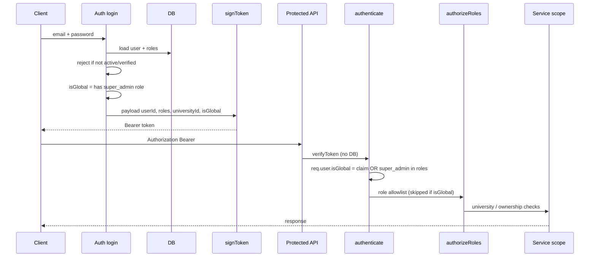

# 08 — Privileged Identity Lifecycle (AUTHZ-003)

**Phase:** investigation + characterization only (no AuthZ behavior change).  
**Date:** 2026-07-16

## Executive verdict

| Question | Answer |
|----------|--------|
| Is `isGlobal` a database column? | **No** |
| Can a client set `isGlobal` via API body? | **No** (schemas `.strict()`, field absent) |
| How does `isGlobal` enter JWT? | Derived at login: any role code === `SUPER_ADMIN_ROLE_CODE` (`super_admin`) |
| Can non–super-admin obtain `isGlobal`? | **No via USER_WRITE alone after Phase 3:** default `USER_WRITE` is **`super_admin` only**; IDENTITY-001 still requires `requester.isGlobal` to assign `super_admin` |
| Direct unauthenticated / student self-escalation of `isGlobal`? | **Not found** |
| AUTHZ-003 direct field exploit? | **Not exploitable** as a writable claim |
| Related privilege risk? | **IDENTITY-001 addressed** — only `isGlobal` requesters may assign/control `super_admin` via user APIs |

---

## 1. Data model

### `users` (Prisma)

| Field | Type | Default | Notes |
|-------|------|---------|-------|
| `id` | uuid | generated | |
| `status` | `user_status` | `inactive` | `active` \| `inactive` \| `suspended` |
| `primary_university_id` | uuid? | null | JWT `universityId` source at login |
| `university_specialty_id` / `specialty_id` | uuid? | null | Not in JWT |
| `email_verified_at`, `activated_at`, `last_login_at` | timestamptz? | null | Login gates on verified + active |
| **`isGlobal` / `is_global`** | — | — | **Does not exist** |

### Roles

| Model | Privileged notes |
|-------|------------------|
| `roles` | `code` unique; `scope` enum `global` \| `university` (seed labels only — not used for JWT `isGlobal`) |
| `user_roles` | Many-to-many; **source of JWT `roles[]`** |
| `permissions` / `role_permissions` | Loaded on login/`me`; **no API writes** in this repo |

### Migration / seed notes

- No migration adds `is_global`.
- Baseline seeds create role rows (incl. `super_admin`); permissions often unseeded.
- Scripts (`testAccounts`, `seed-demo`, …) can create users with chosen roles — **ops risk**, not HTTP.

---

## 2. `isGlobal` write paths

| Path | Writes DB `isGlobal`? | Effect |
|------|----------------------|--------|
| Login `isGlobalFromRoleRecords` | N/A | Computes claim |
| `signToken` | N/A | Embeds claim |
| `authenticate` middleware | N/A | `payload.isGlobal \|\| hasSuperAdminRole` |
| User create/update body | **Impossible** | Rejected by Zod |
| Register | **Impossible** | Fixed student role |

**Effective write of global privilege:** assign `super_admin` into `user_roles` (see §3).

---

## 3. Role write paths

| Path | Auth | Can assign `super_admin`? | Notes |
|------|------|---------------------------|-------|
| `POST /api/v1/users` | `USER_WRITE` | **Yes** if code exists | No elevation guard |
| `PUT /api/v1/users/:id` | `USER_WRITE` + uni access | **Yes** | Full replace of roles when `role_codes` sent |
| `POST /api/auth/register` | Public | **No** | Always student |
| Seeds / test scripts | CLI | Yes | Out of band |

Default `USER_WRITE` = `super_admin` only (Phase 3; `program_admin` stripped even if listed in env).

---

## 4. University assignment paths

| Path | Who | Cross-university? |
|------|-----|-------------------|
| Register | Public (domain-validated uni) | Own registration uni only |
| `POST/PUT /users` `primary_university_id` | `USER_WRITE` | Scoped via `assertUniversityRecordAccess`; **SA (`isGlobal`) system-wide** may set any / null |
| Email domain link | Login/`me`/create side-effect | Fills null primary from email domain |
| `PUT` does not sync `university_users` | — | Membership table may drift |

---

## 5. JWT privileged claims

| Claim | Source at mint | Trusted at request? | DB re-check? |
|-------|----------------|---------------------|--------------|
| `userId` | User row | Yes | No (except `/auth/me`) |
| `roles` | `user_roles` → codes | Yes | **No** |
| `universityId` | `primary_university_id` (after email link) | Yes | **No** |
| `isGlobal` | `isGlobalFromRoleRecords` | Yes (`\|\|` super_admin role) | **No** |
| `status` | — | **Not in JWT** | Login/`me` only |
| `permissions` | — | **Not in JWT** | `/me` / login profile only |

**Expiry:** `JWT_EXPIRES_IN` (default `7d`).  
**Logout:** message only — **no blacklist**.  
**Password change / role change / deactivate:** **do not revoke** existing JWTs.

---

## 6. Sequence (current)

---

## 7. Privileged field matrix

| Field | Source of truth | Creation | Update | JWT | BE consumer | FE consumer | Validation | Allowed actor | Tests | Risk | Confidence |
|-------|-----------------|----------|--------|-----|-------------|-------------|------------|---------------|-------|------|------------|
| `isGlobal` | Derived from SA role | Login mint | N/A (re-mint on login) | claim | `authorizeRoles`, scopes | AuthContext / tenant | Not in bodies | Indirect: USER_WRITE → SA role | identityLifecycle | Stale JWT; PA→SA | Confirmed |
| `roles[]` | `user_roles` | create/register/seeds | PUT replace | claim | AuthZ allowlists | rolePermissions | `role_codes` only | USER_WRITE / register student | identityLifecycle | Escalation via SA code | Confirmed |
| `universityId` | `primary_university_id` | create/register/link | PUT | claim | universityScope | tenant UI | uuid optional | USER_WRITE + scope | scope tests | Stale until re-login | Confirmed |
| `status` | `users.status` | create/register | PUT/PATCH | **absent** | Login/`me` | profile | enum | USER_WRITE / ACTIVATE | validators | Old JWT keeps API access | Confirmed |
| DB `permissions` | `role_permissions` | None in API | None in API | absent | Returned only | Partial FE overlay | N/A | External/manual | — | Unused for BE gates | Confirmed |

---

## 8. Mass assignment

- Controllers use `req.validated.body` only.
- Create/update/register/login schemas use **`.strict()`**.
- **No** `data: req.body` / spread into Prisma in `backend/src`.
- **Finding (updated):** privileged **claim** `isGlobal` cannot be mass-assigned; assigning privileged **role** `super_admin` via `role_codes` now requires `requester.isGlobal === true` (IDENTITY-001).

---

## 9. Findings

### IDENTITY-001 — Non-global could assign `super_admin` (→ `isGlobal` on next login) — **ADDRESSED**

| | |
|--|--|
| Severity | Was **P1** |
| Status | **Addressed** (generalized `isGlobal` gate — not PA-specific) |
| Original path | Any `USER_WRITE` caller (incl. deprecated `program_admin`) could pass `role_codes: ['super_admin']` on create/update |
| Root cause | No privilege boundary beyond env role allowlists |
| Fix | `superAdminPrivilegeBoundary.js` + hooks in `users.service` create/update/status/password/activate/verify-email |
| Rule | Only `requester.isGlobal === true` may add/remove SA roles or administratively mutate an existing SA |
| Protected HTTP | `POST /users`, `PUT /users/:id`, `PATCH /users/:id/status`, `POST /users/:id/reset-password`, `PATCH /users/:id/activate`, `POST /users/:id/verify-email` (+ bulk activate/verify via same services) |
| Error | HTTP **403**, code `SUPER_ADMIN_PRIVILEGE_FORBIDDEN`, message `Forbidden` |
| Tests | `authorization.identity001.superAdminPrivilege.test.js` |
| Not in scope | JWT logout/password revoke (still open); Phase 4 soft-retire catalog |
| `program_admin` | **Deprecated** — Phases 1–3 done; AUTHZ-002 resolved; no runtime access |
| Rollback | Remove boundary calls + delete `superAdminPrivilegeBoundary.js` |

### IDENTITY-002 — Stale JWT retains `isGlobal` / elevated roles until expiry

| | |
|--|--|
| Severity | Was **P1** |
| Status | **Addressed** (current-state auth revalidation — not a session store / blacklist) |
| Original path | `authenticate` copied JWT `roles` / `universityId` / `isGlobal` into `req.user` |
| Fix | `currentAuthContext.js` + `auth.middleware.js`: after JWT verify, load current DB status/roles/uni; derive `isGlobal` via `isGlobalFromRoleRecords`; never fall back to JWT claims |
| Effect | Role / university / `isGlobal` changes apply on the **next** protected request |
| Tests | `authorization.currentAuthContext.test.js`; updated identity lifecycle + middleware characterization |
| Not in scope | Cryptographic token revoke on logout or password change |
| Rollback | Restore JWT-claim `req.user` mapping; remove `currentAuthContext.js` |

### IDENTITY-003 — Deactivated user keeps API access with existing JWT

| | |
|--|--|
| Severity | Was **P1** |
| Status | **Addressed** |
| Original path | Login blocked non-active; `authenticate` never checked status; only `/me` did |
| Fix | Central middleware rejects `status !== 'active'` with **403** `ACCOUNT_INACTIVE` (missing user **401** `USER_NOT_FOUND`) |
| Effect | Deactivation applies on the **next** protected request |
| Tests | Same as IDENTITY-002 suite |
| Rollback | Same as IDENTITY-002 |

### IDENTITY-004 — University change not reflected until re-login

| | |
|--|--|
| Severity | Was **P2** |
| Status | **Addressed** by IDENTITY-002 loader (`primary_university_id` → `req.user.universityId`) |
| Evidence | JWT `universityId` may remain stale but is ignored for AuthZ |

### IDENTITY-005 — `authenticate` trusts `payload.isGlobal` without SA role

| | |
|--|--|
| Severity | Was **P2** (forge if secret leaked) |
| Status | **Addressed** — JWT `isGlobal` / roles not used for `req.user` |
| Note | Login still mints claims for FE; forging elevated claims no longer elevates API AuthZ |

### IDENTITY-006 — Bootstrap/seed scripts can create SA users

| | |
|--|--|
| Severity | **P3** (ops) |
| Evidence | `testAccounts` / demo seeds |
| Note | CLI/scripts bypass HTTP boundary — document for ops; not HTTP IDENTITY-001 |

### IDENTITY-007 — Env `SUPER_ADMIN_ROLE_CODE` / `USER_WRITE` alter privilege surface

| | |
|--|--|
| Severity | **P2** |
| Evidence | `env.js` CSV overrides |

---

## 10. AUTHZ-003 status

| | |
|--|--|
| Direct `isGlobal` assignment by non-SA via API | **Not exploitable** |
| Indirect SA role assignment by non-global via user APIs | **Blocked (IDENTITY-001)** |
| Escalate severity solely because JWT is stateless | **No** |
| Remaining P1 | None for IDENTITY-002/003; logout/password revoke remain optional |
| Remaining residual | Active user’s JWT still works after client logout / password change until expiry (no blacklist) |

---

## 11. Applied fix (IDENTITY-001)

**Files:** `superAdminPrivilegeBoundary.js`, `users.service.js`

**Behavior:** Before role writes or admin mutations of an existing SA, require `requester.isGlobal === true`; else 403 `SUPER_ADMIN_PRIVILEGE_FORBIDDEN`.

**Alternate paths:** Public register remains student-only (schema). No other HTTP path writes `user_roles` except `users.service` create/update. Seeds/CLI remain out of band (IDENTITY-006).

---

## 12. Applied fix (IDENTITY-002 / IDENTITY-003) — current-state revalidation

### Old authentication behavior

1. Read Bearer token.
2. `verifyToken` (signature + expiry).
3. Set `req.user` from JWT claims (`userId`, `roles`, `universityId`, `isGlobal` with legacy OR for SA role).
4. No DB check for status, roles, or university.

### New authentication behavior

1. Read Bearer token.
2. Verify signature + expiry.
3. Extract stable `userId` only (never from body/query/headers).
4. `loadCurrentAuthContext(userId)` — lean Prisma selects; fail closed if missing/inactive.
5. Derive `isGlobal` from **current** role records (`isGlobalFromRoleRecords`).
6. Set `req.user = { userId, roles, universityId, isGlobal }` from DB.
7. Continue to `authorizeRoles` / service scope using that identity.

### Authoritative vs informational

| Field | Authoritative source on protected requests | Still in JWT? |
|-------|--------------------------------------------|---------------|
| `userId` | Verified JWT subject, then must exist in DB | Yes |
| `roles` | Current `user_roles` → `roles.code` | Yes (informational) |
| `universityId` | Current `users.primary_university_id` | Yes (informational) |
| `isGlobal` | Current role records via `isGlobalFromRoleRecords` | Yes (informational) |
| status | Must be `active` or request denied | No |

### Route coverage

- **Covered:** every route using `authenticate` / `authMiddleware` under `/api/:version/*` and `GET /api/auth/me`.
- **Public / excluded:** `/`, `/health`, `/health/ready`, unauthenticated auth flows, `POST /api/auth/logout` (message-only, no revoke), `/api/*/public/*`, `GET .../certificates/verify/:verificationCode`, `/uploads`.
- **Bypass:** none with custom JWT verify. Dead `role.middleware.js` is unused (backlog only).

### Performance

- **~3 DB queries** per protected request: `users.findUnique`, `user_roles.findMany`, `roles.findMany` (permissions not loaded).
- `/me` and some services may load the user again for profile/business data — do not cache in this patch; reuse `req.user` for AuthZ fields where identical.

### Remaining risks (not resolved)

- Logout does not invalidate JWTs.
- Password change does not invalidate JWTs.
- Stolen active-user tokens remain valid until expiry unless status/roles change.

### Rollback

1. Revert `auth.middleware.js` to JWT-claim `req.user` mapping.
2. Remove `backend/src/modules/auth/currentAuthContext.js`.
3. Revert related unit tests / docs.
4. No DB migration to roll back (none applied).
