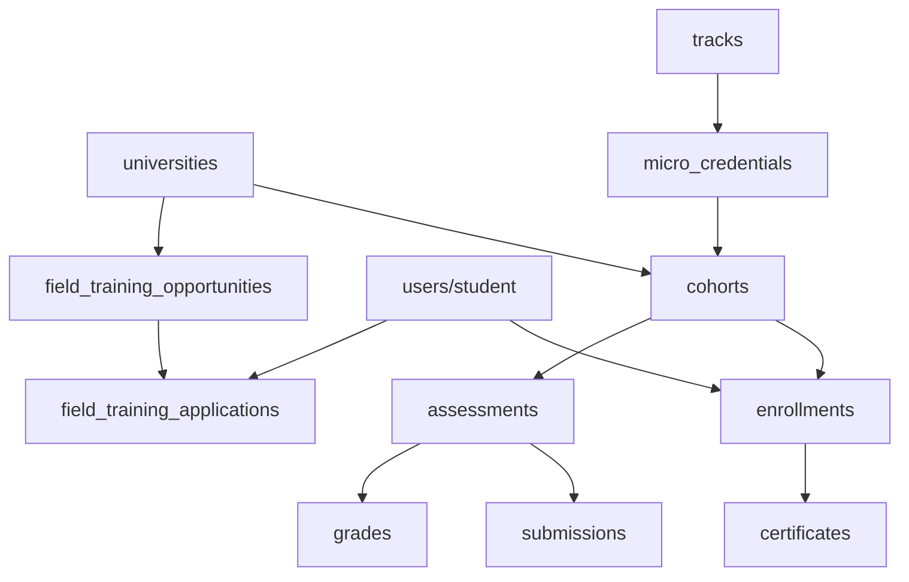

# المنتج والمجال

## الغرض الظاهر للمنتج

**السلوك المرصود (Confirmed):** منصة LMS لتشغيل برامج شهادات مصغّرة مرتبطة بجامعات، مع بوابات متعددة الأدوار، تسليم محتوى، تقييم، جودة، اعتراف، شهادات، وتدريب ميداني.

**النية التجارية المحتملة (Strong inference):** تسهيل شراكة BATTECHNO مع الجامعات الأردنية لطرح برامج قصيرة قابلة للاعتراف الأكاديمي، مع ضوابط جودة وأدلة قابلة للمراجعة.

**متطلبات مجهولة (Unknown):** اتفاقيات الاعتماد الرسمية، نسب النجاح المطلوبة خارج الحقول في المخطط، SLA التشغيل.

## المشكلة التي يعالجها

| المشكلة | كيف تظهر في النظام |
|---------|---------------------|
| التحقق من انتماء الطالب لجامعة | نطاقات بريد في `university_email_domains` عند التسجيل |
| تشغيل أفواج (cohorts) محدودة السعة | `cohorts` + `enrollments` مع موافقة |
| إثبات الجودة والاعتراف | `qa_reviews`, `evidence_files`, `recognition_requests` |
| إثبات الإنجاز | `certificates` + تحقق عام |
| التدريب العملي المنفصل عن المقررات | وحدة `field_training_*` |

## المستخدمون المستهدفون

1. **طاقم BATTECHNO / إدارة البرنامج** — إعداد النظام والمناهج والتحليلات.
2. **إداريو الجامعات والأكاديميون ومسؤولو الجودة**.
3. **المدربون / المدرسون**.
4. **الطلاب الجامعيون** ذوو بريد نطاق معتمد.
5. **مراجعو الجامعات** لطلبات التسجيل والاعتراف.

## الأدوار الرئيسية

انظر أيضًا [08_AUTHENTICATION_AND_AUTHORIZATION.md](./08_AUTHENTICATION_AND_AUTHORIZATION.md).

| رمز الدور | النطاق في DB | استخدام الواجهة |
|-----------|--------------|-----------------|
| `super_admin` | `global` | بوابة `/admin` + تحليلات ومقررات وتدريب |
| `program_admin` | `university` | **متوقف** — عرض/تصفية تاريخية فقط (لا بوابة) |
| `university_admin` | `university` | `/admin` |
| `academic_admin` | `university` | `/admin` + `/academic` |
| `qa_officer` | `university` | `/admin` + `/academic` |
| `instructor` | `university` | `/instructor` |
| `student` | `university` | `/student` |
| `university_reviewer` | `university` | `/reviewer` + `/academic` |

**الدليل:** `backend/scripts/lib/baselineCatalog.js` → `REQUIRED_ROLES`؛ `frontend/src/constants/roles.js`.

## الكيانات الأساسية للمجال

| الكيان | المعنى التجاري |
|--------|----------------|
| `universities` | جامعة شريكة |
| `specialties` / `university_specialties` | تخصصات عامة / برامج جامعية |
| `tracks` | مسار أكاديمي يجمع شهادات مصغّرة |
| `micro_credentials` | شهادة مصغّرة (الوحدة التعليمية الأساسية) |
| `cohorts` | فوج تشغيل زمني لشهادة + جامعة |
| `enrollments` | تسجيل طالب في فوج |
| `modules` / `contents` / `sessions` | هيكل المحتوى والجلسات |
| `assessments` / `submissions` / `grades` | التقييم الأكاديمي |
| `courses` (+ lessons) | مقررات LMS مستقلة قابلة للربط بالفوج |
| `field_training_*` | فرص تدريب ميداني ودورة حياة المشارك |
| `recognition_requests` | طلب اعتراف جامعي |
| `certificates` | شهادة صادرة قابلة للتحقق |
| `qa_reviews` / `corrective_actions` | ضمان الجودة |
| `risk_cases` / `integrity_cases` | مخاطر ونزاهة |

## مصطلحات أعمال مهمة

انظر المسرد الكامل في [15_PROJECT_GLOSSARY.md](./15_PROJECT_GLOSSARY.md).

| مصطلح | معنى في المشروع |
|-------|-----------------|
| Micro-credential | برنامج/شهادة مصغّرة تحت مسار |
| Cohort | فوج تسليم بجامعة ومدرب وسعة |
| Recognition | سير عمل اعتراف الجامعة بالبرنامج/النتائج |
| Field training | تدريب ميداني منفصل عن المقررات/الأفواج |
| Eligibility | أهلية إتمام التدريب أو الظهور للفرص |
| Activation | تفعيل حساب طالب بعد التحقق من البريد |

## مجموعات الميزات

| المجموعة | أمثلة وحدات/صفحات |
|----------|-------------------|
| الهوية والوصول | auth، users، roles |
| الشراكة الجامعية | universities، specialties، نطاقات البريد |
| المنهج | tracks، micro-credentials، learning-outcomes، modules |
| التسليم | cohorts، enrollments، sessions، attendance |
| الأكاديميا | assessments، rubrics، submissions، grades |
| الجودة والحوكمة | qa، corrective، risk، integrity، audit-logs |
| الاعتراف والشهادات | recognition-*, certificates |
| المقررات | admin/student courses + lesson training |
| التدريب الميداني | admin/instructor/student/academic FT |
| التحليلات والتقارير | analytics، reports، exports |
| الإشعارات والإعدادات | notifications، settings، files، AI |

## قواعد عمل مرصودة (مع حالات)

### تسجيل الطالب

1. يجب أن ينتمي البريد لنطاق نشط لجامعة (`university_email_domains`).
2. الحساب يُنشأ `inactive` وبدون `email_verified_at`.
3. بعد OTP يبقى غير نشط حتى `activate`.
4. **Confirmed:** `auth.service.js` register + activate routes.

### التسجيل في فوج (enrollment)

حالات `enrollment_status`: `pending` → `enrolled` / `rejected` / …  
قرار الموافقة عبر أدوار `ENROLLMENT_DECISION_ROLE_CODES` (يشمل `university_reviewer`).

### حالة الشهادة المصغّرة

`micro_credential_status`: `draft` → `under_review` → `approved` → `active` → `archived`  
بالإضافة إلى `internal_approval_status`.

### حالة الفوج

`planned` → `open_for_enrollment` → `active` → `completed` / `closed` / `cancelled`.

### التدريب الميداني — دورة المشارك

- طلب: `field_training_application_status` (`pending`/`approved`/…).
- بعد الموافقة: `field_training_training_status` (مسار طويل من pre-assessment إلى completed/failed/expelled).
- **Confirmed:** enums في `schema.prisma` ومسارات workflow.

### الاعتراف

`recognition_request_status` من `draft` إلى `approved`/`rejected`/`needs_revision` مع مستندات بأنواع `recognition_document_type`.

### الشهادات

إصدار + `verification_code` عام عبر `GET /api/v1/certificates/verify/:verificationCode` وصفحة `/verify/certificate/:verificationCode`.

## القدرات الإدارية

- CRUD للمستخدمين والجامعات والمناهج والأفواج.
- تفعيل جماعي للطلاب وتعليم البريد كمتحقق.
- تحليلات `super_admin` وتصدير.
- إعدادات نظام `system_settings` (مقيدة بـ `super_admin`).
- سجلات تدقيق للقراءة.

## التقارير والإشعارات

- تقارير عامة تحت `/api/v1/reports/*` وتقارير تدريب ميداني.
- إشعارات داخل التطبيق (`notifications`) تُنشأ من خدمات التسجيل والأحداث (`eventDispatcher`).
- بريد OTP عبر Resend (إن وُجد المفتاح).

## فصل المرصود / المقصود / المجهول

| مرصود | مقصود محتمل | مجهول |
|-------|-------------|-------|
| بوابات أدوار منفصلة ونطاقات فرعية | فصل تشغيلي للجامعات/الأدوار | هل النطاقات الفرعية مستخدمة في الإنتاج؟ |
| صلاحيات UI منفصلة عن جدول permissions | RBAC مستقبلي | هل سيُزرع جدول permissions؟ |
| AI اختياري للتقييم الذاتي/التصحيح | تسريع التصحيح | سياسات الخصوصية للنصوص المرسلة للـ AI |
| جامعات أردنية في baseline seed | تركيز جغرافي أولي | هل يدعم جامعات خارج الأردن بنفس القواعد؟ |
