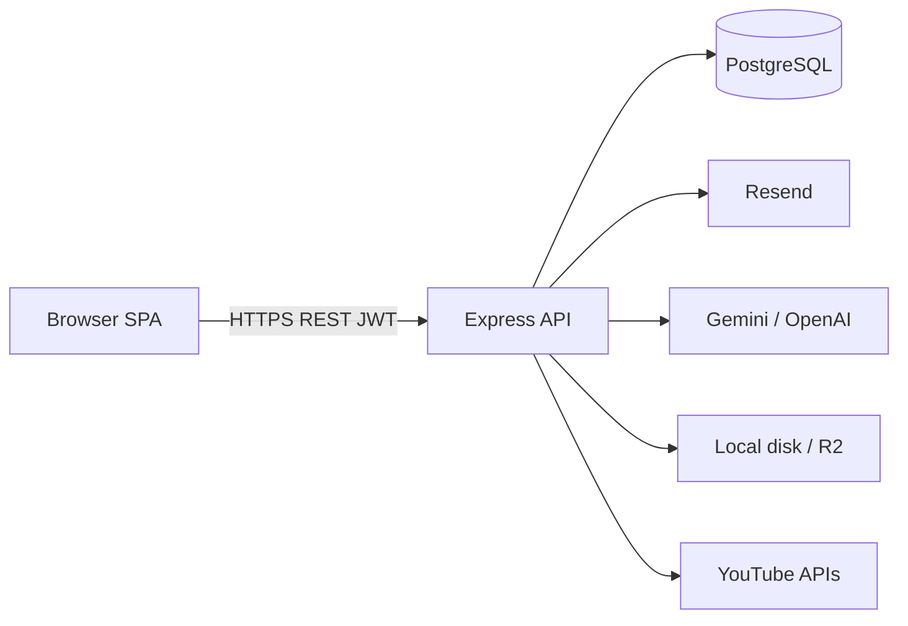
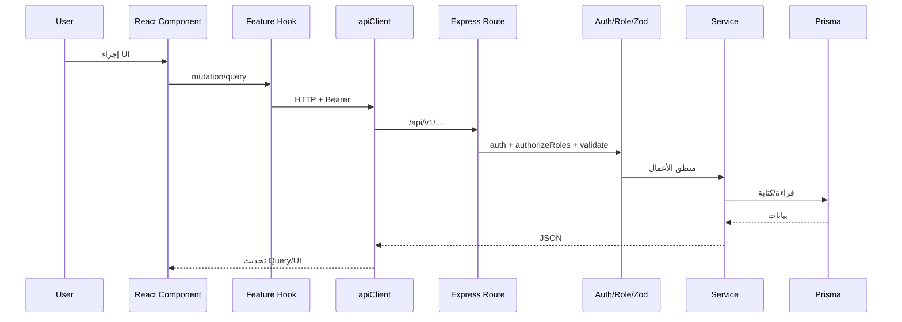
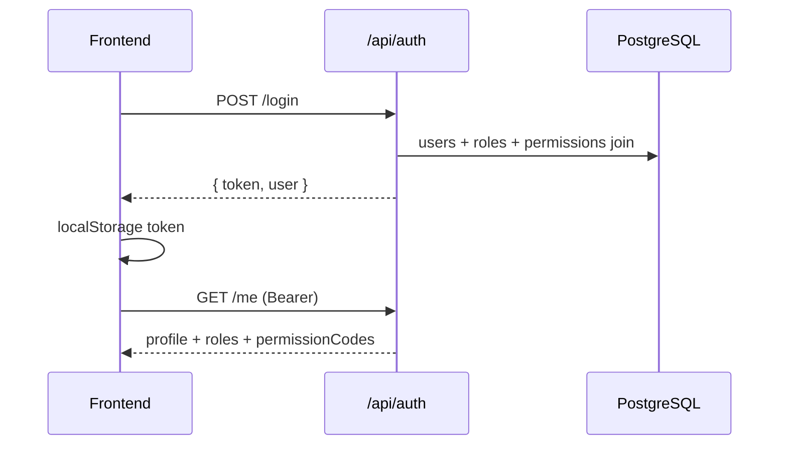
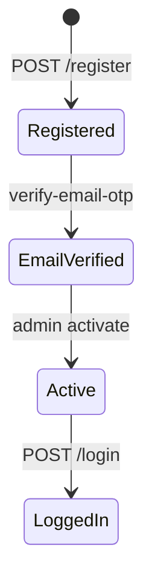
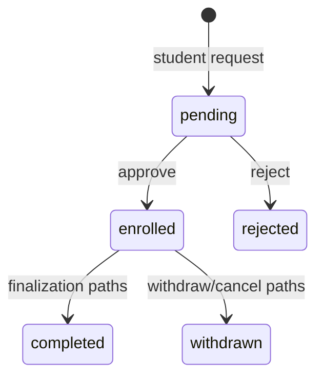
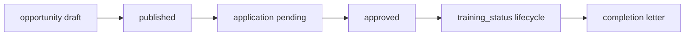

# معمارية النظام

## نظرة عامة



**الثقة:** Confirmed من الاعتماديات والكود؛ أسماء المضيفين الإنتاجية من `app.js` CORS و`docs/DEPLOYMENT.md` (Strong inference لشكل النشر).

## طبقات النظام

| الطبقة | التقنية | الموقع |
|--------|---------|--------|
| واجهة | React SPA | `frontend/` |
| API | Express REST | `backend/src` |
| تحقق طلبات | Zod + `validateRequest` / `validateBody` | modules `*.validation.js` |
| منطق أعمال | services | `*.service.js` |
| وصول بيانات | Prisma repositories | `*.repository.js` |
| قاعدة بيانات | PostgreSQL | `prisma/schema.prisma` |
| مصادقة | JWT Bearer | `utils/jwt.js`, `auth.middleware.js` |
| تفويض | `authorizeRoles` + university scope | `authorization.middleware.js`, `universityScope.js` |
| تخزين ملفات | local أو R2 (S3 API) | `shared/storage`, `files` module |
| أحداث داخلية | `dispatchAppEvent` | `eventDispatcher.service.js` |
| إشعارات داخل التطبيق | `notifications` table | `notification.service.js` |
| بريد | Resend | `email.service.js` |
| تسجيل | morgan-style request logger + `logger` | middlewares/utils |
| مراقبة خارجية | غير مكتشفة (Sentry وغيرها) | Unknown / absent in code |

## اتجاه الاعتماديات

```
pages/features → services/apiClient → backend routes
  → controllers → services → repositories → Prisma → DB
shared services ← modules (events, email, storage)
```

الواجهة لا تستورد شفرة الـ backend؛ لا توجد حزمة domain مشتركة.

## تدفق طلب نموذجي



**مثال Confirmed:** تسجيل الدخول — `LoginPage` / portal login → `AuthContext` → `POST /api/auth/login` → `auth.service.login` → JWT → `localStorage` → طلبات لاحقة مع interceptor.

## مخطط سياق النظام

```mermaid
C4Context
  title BATTECHNO LMS — System Context (مستنتج من المستودع)
  Person(student, "Student")
  Person(staff, "Admin / Instructor / Reviewer")
  System(lms, "BATTECHNO LMS")
  System_Ext(uni_mail, "University email domains")
  System_Ext(resend, "Resend")
  System_Ext(ai, "AI Provider")
  System_Ext(r2, "Object Storage")
  System_Ext(yt, "YouTube")
  System_Ext(pg, "PostgreSQL")

  student --> lms
  staff --> lms
  lms --> pg
  lms --> resend
  lms --> ai
  lms --> r2
  lms --> yt
  student --> uni_mail
```

## مكوّنات التطبيق الرئيسية

```mermaid
flowchart TB
  subgraph FE[frontend]
    Router[AppRouter]
    Layouts[Admin/Instructor/Student/Reviewer Layouts]
    Features[features/* services + hooks]
    Router --> Layouts --> Features
  end

  subgraph BE[backend]
    Auth[/api/auth]
    V1[/api/v1 modules]
    Shared[shared: email storage events]
    Auth --> Shared
    V1 --> Shared
  end

  Features --> Auth
  Features --> V1
  Shared --> PG[(PostgreSQL)]
```

## تدفق المصادقة



تفاصيل إضافية: [08_AUTHENTICATION_AND_AUTHORIZATION.md](./08_AUTHENTICATION_AND_AUTHORIZATION.md).

## سير عمل أعمال رئيسي — تسجيل طالب



## سير عمل — Enrollment



## سير عمل — Field training (مبسّط)



التفاصيل الدقيقة لحالات `training_status` في [07_DATABASE_AND_DATA_MODEL.md](./07_DATABASE_AND_DATA_MODEL.md).

## التخزين المؤقت

| الطبقة | المرصود |
|--------|---------|
| Frontend | TanStack Query cache (`lib/queryClient.js`) |
| Backend | لا Redis/Memcached مكتشَف — Unknown/absent |
| HTTP | rate limiting فقط |

## معالجة الأخطاء

- Backend: `error.middleware.js` + `ApiError`.
- Frontend: `ErrorBoundary.jsx` + رسائل من استجابات API في النماذج/hooks.

## معمارية النشر (من الوثائق + CORS)

```
SPA (lms.battechno.com) → API host → PostgreSQL
         ↘ uploads/R2
```

Docker للـ backend فقط؛ لا compose. التفاصيل في [12_CONFIGURATION_AND_DEPLOYMENT.md](./12_CONFIGURATION_AND_DEPLOYMENT.md).
