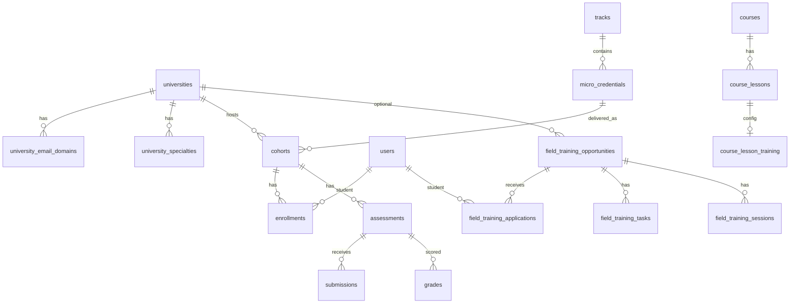

# قاعدة البيانات ونموذج البيانات

**المصدر الوحيد للتحليل:** `backend/prisma/schema.prisma` + مجلد `backend/prisma/migrations/`  
**لم يُنفَّذ أي استعلام على بيانات حية.**

## محرك البيانات

| الخاصية | القيمة | الثقة |
|---------|--------|-------|
| DBMS | PostgreSQL | Confirmed |
| ORM | Prisma 6 | Confirmed |
| معرّفات | UUID (`gen_random_uuid()`) في أغلب الجداول | Confirmed |
| timestamps | `created_at` / `updated_at` شائعة | Confirmed |
| soft delete | واضح في `files.deleted_at` | Confirmed؛ ليس نمطًا عامًا لكل الجداول |

## إحصاءات

| العنصر | العدد |
|--------|------:|
| `model` في schema | 60 |
| `enum` في schema | 53 |
| مجلدات migrations | 26 |

### ملاحظة تحقق ثاني — `attempt_status`

يوجد `enum attempt_status` في `schema.prisma` **بدون** `model attempts`. الحقل `submissions.attempt_id` اختياري. محاولات التدريب الميداني نموذج منفصل: `field_training_assessment_attempts`.  
**التصنيف:** Contradiction / فجوة مخطط (Confirmed للغياب؛ Unknown للنية).

## مجموعات الكيانات

### الهوية والوصول

| الجدول | المعنى |
|--------|--------|
| `users` | حسابات؛ `password_hash`, `status`, `primary_university_id`, تخصصات، تحقق بريد |
| `roles` | أدوار برموز ونطاق `role_scope` |
| `permissions` | كتالوج صلاحيات (هيكلي) |
| `role_permissions` / `user_roles` | ربط |
| `university_users` | علاقة مستخدم↔جامعة |
| `email_verification_otps` / `password_reset_otps` | OTP مع hashes ومحاولات |
| `system_settings` | إعدادات JSON بمفتاح فريد |

**حقول حساسة:** `password_hash`, `code_hash`, `reset_token_hash` — مخزّنة hashed وليس plaintext (Confirmed من أسماء الحقول + خدمات OTP).

### الجامعات والتخصصات

| الجدول | المعنى |
|--------|--------|
| `universities` | شريك جامعي + حالة شراكة |
| `university_email_domains` | نطاقات بريد مسموحة |
| `specialties` | تخصصات عامة مشتركة |
| `university_specialties` | برامج خاصة بجامعة (قد ترتبط بتخصص عام) |

### المنهج والتسليم الأكاديمي

| الجدول | المعنى |
|--------|--------|
| `tracks` | مسار |
| `micro_credentials` | شهادة مصغّرة |
| `micro_credential_universities` | ربط جامعات بالشهادة |
| `micro_credential_versions` | إصدارات |
| `learning_outcomes` | نواتج تعلم |
| `modules` / `contents` | وحدات ومحتوى |
| `cohorts` | فوج |
| `enrollments` | تسجيل |
| `sessions` | جلسة |
| `attendance_records` | حضور جلسة |
| `assessments` / `submissions` / `grades` | تقييم |
| `rubrics` / `rubric_criteria` | نماذج تقييم |
| `evidence_files` | أدلة |
| `qa_reviews` / `corrective_actions` | جودة |
| `risk_cases` / `integrity_cases` | مخاطر/نزاهة |
| `recognition_requests` / `recognition_documents` | اعتراف |
| `certificates` | شهادات صادرة |
| `notifications` | إشعارات |
| `audit_logs` | تدقيق append-oriented |

### المقررات المستقلة

`courses`, `course_sections`, `course_lessons`, `course_cohorts`, `course_enrollments`, `course_lesson_progress`, `course_lesson_training`, `course_lesson_questions`, `course_lesson_student_workflow`.

### التدريب الميداني

`field_training_opportunities`, `field_training_opportunity_eligibility`, `field_training_applications`, `field_training_tasks`, `field_training_task_submissions`, `field_training_sessions`, `field_training_attendance`, `field_training_assessments`, `field_training_assessment_questions`, `field_training_assessment_attempts`, `field_training_completion_letters`.

### الملفات

`files` — بيانات وصفية للتخزين مع `visibility` و`deleted_at`.

## مخطط علاقات مبسّط (مؤكد)

**ملاحظة:** ليس كل العلاقات مُعرَّفة كـ Prisma `@relation` صريحة في كل الجداول القديمة؛ بعضها يعتمد على معرفات UUID بدون relation object — Contradiction محتمل بين سلامة مرجعية DB وORM.

## حالات مهمة (enums مختارة)

| المجال | قيم أساسية |
|--------|------------|
| `user_status` | active, inactive, suspended |
| `enrollment_status` | pending, enrolled, withdrawn, cancelled, completed, rejected |
| `final_status` | in_progress, passed, failed, withdrawn, incomplete |
| `cohort_status` | planned, open_for_enrollment, active, completed, closed, cancelled |
| `micro_credential_status` | draft, under_review, approved, active, archived |
| `certificate_status` | issued, revoked, superseded |
| `field_training_training_status` | none → … → completed / failed / expelled (مسار طويل) |
| `recognition_request_status` | draft … approved/rejected/needs_revision |

## مسارات إنشاء/قراءة/تحديث (عينة)

| الكيان | إنشاء | قراءة | تحديث/حالة | حذف |
|--------|-------|-------|------------|-----|
| users | register / admin create | list/get | status/activate | غير واضح كحذف صلب |
| enrollments | request APIs | list/me/pending | approve/reject/status | — |
| certificates | POST issue | list/get/verify | patch status | — |
| FT applications | student apply | portals | status/expel/eligibility | cancel |
| files | confirm upload | download-url | — | DELETE (+ soft) |

## سجل الهجرات (مستوى عالٍ)

الهجرات مؤرخة بأسماء مثل:

- حضور وتقييمات وشهادات وتدقيق (أبريل 2026 في أسماء المجلدات)
- سير عمل تسجيل وإشعارات وتفعيل مستخدم
- مقررات / lesson training
- سلسلة كبيرة لـ field training (أهلية، workflow، ملفات، AI audit، indexes)
- OTP بريد وإعادة كلمة مرور
- تخزين `files`

**لا تُشغَّل الهجرات في هذه المرحلة.** الترتيب الزمني يظهر من أسماء المجلدات تحت `prisma/migrations/`.

## تناقضات / فجوات النموذج

| الموضوع | التصنيف |
|---------|---------|
| `permissions` بلا seed ظاهر | Contradiction مع تحميل permissionCodes في login |
| علاقات Prisma ناقصة لبعض الجداول القديمة مقابل FK منطقية | Weak inference |
| `contents` موجود في المخطط؛ عمق استخدام UI/API يحتاج تحققًا | Unknown جزئيًا |
| ازدواجية تخصص: `specialty_id` و`university_specialty_id` على users | Confirmed في schema؛ قواعد المزامنة في الخدمات |

## حقول ملكية ونطاق

- `primary_university_id` على المستخدم
- `university_id` على cohorts / recognition / فرص FT
- `assigned_instructor_id` على فرص التدريب
- `created_by` / `uploaded_by` / `grader_id` في عدة كيانات

لا يوجد عمود `tenant_id` عام — النموذج جامعي عبر الحقول أعلاه.
